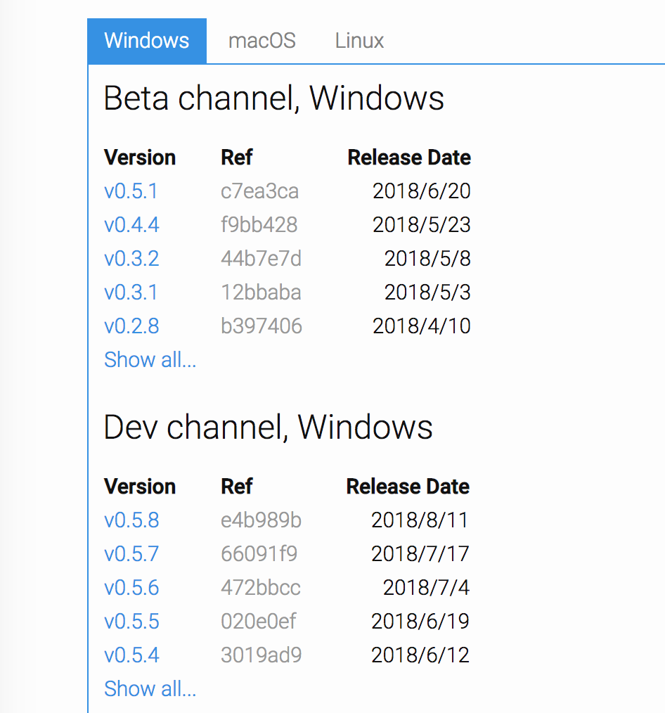
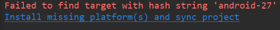
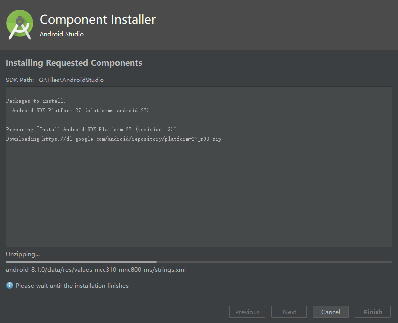
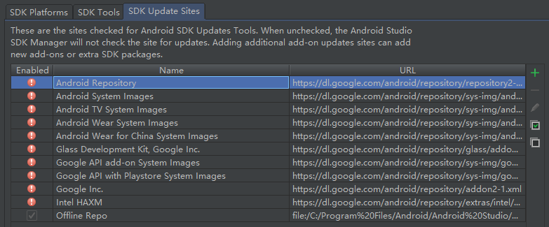

# 1.3 Build Flutter development environment

Let's sharpen our tools. This section will first introduce the installation of Flutter SDK under Windows and macOS respectively, and then introduce the use of IDE and simulator.

## 1.3.1 Install Flutter

Since Flutter will build release packages for both Android and IOS platforms at the same time, Flutter relies on both Android SDK and iOS SDK. When installing Flutter, you also need to install the corresponding platform's build tools and SDK. Below we respectively introduce the environment construction under Windows and macOS.

> Note: The installation method introduced in this section may change with the upgrade of Flutter. If the content described below is no longer valid when you install Flutter, please visit the official website of Flutter and install it according to the latest installation tutorial on the official website.

### Build a Flutter development environment on Windows

#### System Requirements

To install and run Flutter, your development environment must meet the following minimum requirements:

-   Operating system: Windows 7 or higher (64-bit)
   
-   Disk space: 400 MB (not including the disk space of Android Studio).
   
-   Tools: Flutter relies on the following command-line tools.
   
   -   [PowerShell 5.0](https://docs.microsoft.com/en-us/powershell/scripting/setup/installing-windows-powershell#upgrading-existing-windows-powershell) or newer
       
   -   [Git for Windows](https://git-scm.com/download/win) (Git command line tool);
       
   
   If you have installed Git for Windows, make sure you can run git commands in the command prompt or PowerShell
   

#### Get the Flutter SDK

1.  Go to flutter official website to download the latest available installation package, download address: [https://flutter.dev/docs/development/tools/sdk/releases](https://flutter.dev/docs/development/tools/sdk/releases) , after opening it, it is shown in Figure 1-2:
   
   
   

Note that the channel version of Flutter will change constantly, please refer to the official website of Flutter. Readers can also go to the Flutter github project to download the installation package at: [https://github.com/flutter/flutter/ releases](https://github.com/flutter/flutter/releases) .

1.  Unzip the installation package zip to the path where you want to install the Flutter SDK (such as :; `C:\src\flutter` note, **do not** install flutter to a path that requires some high permissions, such as `C:\Program Files\`).
   
2.  `flutter` Find it under the file in the Flutter installation directory `flutter_console.bat`, double-click to run and start the **flutter command line** , and then you can run the flutter command on the Flutter command line.
   

##### Update environment variables

If you want to run flutter commands on the command line that comes with the Windows system, you need to add the following environment variables to the user PATH:

-   Go to "Control Panel> User Accounts> User Accounts> Change My Environment Variables"
-   Under "User Variables" check if there is an entry named "Path":
   -   If the entry exists, append the full path of flutter\bin and use; as the separator.
   -   If the entry does not exist, create a new user variable Path, and then the `flutter\bin`full path as its value.

Restart Windows to apply this change.

##### Run flutter doctor command

Run the following command on the Flutter command line to see if other dependencies need to be installed, and if necessary, install them:

``` dart 
flutter doctor

```

This command checks your environment and displays the report in the command line window. The Dart SDK is already being packaged in the Flutter SDK, there is no need to install Dart separately. Check the command line output carefully for other software that may need to be installed or further tasks that need to be performed.

E.g:

``` dart 
[-] Android toolchain - develop for Android devices
   • Android SDK at D:\Android\sdk
   ✗ Android SDK is missing command line tools; download from https://goo.gl/XxQghQ
   • Try re-installing or updating your Android SDK,
     visit https://flutter.io/setup/#android-setup for detailed instructions.

```

The first time you run a flutter command (such as `flutter doctor`), it will download its own dependencies and compile it by itself. It will run much faster later. The missing dependencies need to be installed. After the installation is complete, run the `flutter doctor`command to verify whether the installation is successful.

#### Android settings

Flutter relies on the full installation of Android Studio. Android Studio can not only manage Android platform dependencies, SDK versions, etc., but it is also one of the IDEs recommended for Flutter development (of course, you can also use other editors or IDEs, which we will discuss later).

##### Install Android Studio

1.  Download and install Android Studio, download address: [https://developer.android.com/studio/index.html](https://developer.android.com/studio/index.html) .
2.  Start Android Studio, and then execute the "Android Studio Installation Wizard". This will install the latest Android SDK, Android SDK platform tools and Android SDK build tools, which are required for Android development with Flutter.

#### Having trouble with installation?

If you encounter problems during the installation process, you can first go to the flutter official website to check whether the installation method has changed, or search for solutions on the Internet.

### Build a Flutter development environment on macOS

Android and iOS devices can be tested simultaneously under masOS.

#### System Requirements

To install and run Flutter, your development environment must meet the following minimum requirements:

-   Operating system: macOS (64-bit)
-   Disk space: 700 MB (not including the disk space of Xcode or Android Studio).
-   Tools: Flutter relies on the following command-line tools.
   -   `bash、mkdir、rm、git、curl、unzip、which`

#### Get the Flutter SDK

1.  Go to flutter official website to download the latest available installation package, official website address: [https://flutter.io/sdk-archive/#macos](https://flutter.io/sdk-archive/#macos)
   
   Note that the channel version of Flutter will change constantly, please refer to the official website of Flutter. In addition, in mainland China, if you want to get the list of installation packages or download the installation package normally, you may need to go over the wall. Readers can also go to the Flutter github project to download the installation package at: [https://github.com/flutter/flutter/ releases](https://github.com/flutter/flutter/releases) .
   
2.  Unzip the installation package to the directory you want to install, such as:
   
``` dart 
   cd ~/development
   unzip ~/Downloads/flutter_macos_v0.5.1-beta.zip
   
```
   
3.  Add `flutter`related tools to the path:
   
``` dart 
   export PATH=`pwd`/flutter/bin:$PATH
   
```
   
   This code can only temporarily set the PATH environment variable for the current command line window. If you want to permanently add Flutter to the PATH, please refer to the **Update Environment Variables** section below .
   

##### Run flutter doctor command

This step is consistent with the steps under Windows, so I won't repeat it.

##### Update environment variables

Add Flutter to the PATH, you can run `flutter` commands in any terminal session .

The steps to permanently modify this variable for all terminal sessions are specific to the computer system. Usually, you will add the command for setting environment variables to the executed file when you open a new window. E.g

1.  Make sure that the directory of your Flutter SDK is recorded as "FLUTTER_INSTALL_PATH", which you will use in step 3.
   
2.  Open (or create) `$HOME/.bash_profile`. The file path and file name may be different on your computer.
   
3.  Add the following path:
   
``` dart 
   export PATH=[FLUTTER_INSTALL_PATH]/flutter/bin:$PATH
   
```
   
   For example, the author's Flutter installation directory is "~/code/flutter_dir", then the code is:
   
``` dart 
   export PATH=~/code/flutter_dir/flutter/bin:$PATH
   
```
   
4.  Run `source $HOME/.bash_profile` refresh the current terminal window.
   
   > **Note:** If you are using a terminal zsh, when the terminal starts `~/.bash_profile` will not be loaded, the solution is to modify `～/.zshrc`, in add: source ~ / .bash_profile
   
5.  Verify that "flutter/bin" is already in the PATH:
   
``` dart 
   echo $PATH
   
```
   

#### Install Xcode

To develop Flutter apps for iOS, you need Xcode 9.0 or higher:

1.  Install Xcode 9.0 or later ( [download](https://developer.apple.com/xcode/) via [link](https://developer.apple.com/xcode/) or [Apple App Store](https://itunes.apple.com/us/app/xcode/id497799835) ).
2.  Configuration command-line tool Xcode Xcode to use the newly installed version `sudo xcode-select --switch /Applications/Xcode.app/Contents/Developer`for the most part, when you want to use the latest version of Xcode, this is the right path. If you need to use a different version, please specify the corresponding path.
3.  Make sure that the Xcode license agreement is approved by opening Xcode once or through commands `sudo xcodebuild -license`.

With Xcode, you can run Flutter applications on iOS devices or simulators.

#### Install Android Studio

Like Window, you need to install Android Studio first to build and run Flutter programs on Android devices. Readers can download and install Android Studio first, so I won’t repeat them here.

### Upgrade Flutter

#### Flutter SDK branch

The Flutter SDK has multiple branches, such as beta, dev, master, and stable. Among them, the stable branch is a stable branch (in the future, there may be a new stable branch after a new stable version is released, such as 1.0.0). Dev and master are Development branch, after installing flutter, you can run to `flutter channel` view all branches, for example, after the author runs locally, the result is as follows:

``` dart 
Flutter channels:
 beta
 dev
* master

```

The branch with "*" is the branch tracked by your local Flutter SDK. To switch branches, you can use `flutter channel beta`or `flutter channel master`. Flutter officially recommends tracking stable branches, but you can also track `master`branches so that you can view the latest changes, but this is stable Much lower.

#### Upgrade Flutter SDK and dependent packages

To upgrade flutter sdk, just one command:

``` dart 
flutter upgrade

```

This command will update both the Flutter SDK and your flutter project dependencies. If you only want to update the project dependencies (excluding the Flutter SDK), you can use the following command:

-   `flutter packages get` Get all the dependent packages of the project.
-   `flutter packages upgrade` Get the latest version of all dependent packages of the project.

## 1.3.2 IDE configuration and use

In theory, any text editor and command line tool can be used to build Flutter applications. However, Flutter officially recommends using one of Android Studio and VS Code for a better development experience. Flutter officially provides these two editor plug-ins. Through IDE and plug-ins, you can obtain functions such as code completion, syntax highlighting, widget editing assistance, running and debugging support, which can help us greatly improve development efficiency. Below we respectively introduce the configuration and use of Android Studio and VS Code (readers of Android Studio and VS Code can get the latest installation on their official website, because the installation is relatively simple, so I will not repeat it).

### Android Studio configuration and use

Since Android Studio is developed based on IntelliJ IDEA, readers can also use IntelliJ IDEA.

#### Install Flutter and Dart plugins

Two plugins need to be installed:

-   `Flutter` Plug-in: Support Flutter development workflow (run, debug, hot reload, etc.).
-   `Dart` Plug-in: Provide code analysis (validation when entering code, code completion, etc.).

installation steps:

1.  Launch Android Studio.
2.  Open the plugin preferences (macOS: **Preferences>Plugins** , Windows: **File>Settings>Plugins** ).
3.  Select **Browse repositories...** , select the flutter plug-in and click `install`.
4.  The plug-in takes effect after restarting Android Studio.

Next, let us create a Flutter project with Android Studio, then run it and experience "hot reloading".

#### Create Flutter app

1.  Select **File>New Flutter Project** .
2.  Select **Flutter application** as the project type, and click Next.
3.  Enter the project name (for example `myapp`) and click Next.
4.  Click **Finish** .
5.  Wait for Android Studio to install the SDK and create the project.

The above command creates a Flutter project named myapp, which contains a simple demo application that uses [Material components](https://material.io/guidelines/) .

In the project directory, the code of your application is located `lib/main.dart`.

#### Run the application

1.  Locate the Android Studio toolbar, as shown in Figure 1-3:
   
   
   
2.  In the **target selector** , select an Android device running the application. If it is not listed, please select **Tools>Android>AVD Manager** and create one there.
   
3.  Click the **Run icon in the toolbar** .
   
4.  If everything is ok, you should see the launched application on your device or emulator:
   
   
   

#### Experience hot reload

Flutter by _thermal overloads (hot reload)_ to achieve rapid development cycle, thermal overload is real-time without having to restart the application will be able to load the modified code, and the state is not lost. Simply make changes to the code, then tell the IDE or command line tool that you need to reload (click the reload button), and you will see the changes on your device or simulator.

1.  Open `lib/main.dart`file
2.  The string `'You have pushed the button this many times:'`Change`'You have clicked the button this many times:'`
3.  Don't press the "Stop" button; let your app continue to run.
4.  To check the changes, please call **the Save** ( `cmd-s`/ `ctrl-s`), or click **the thermal overload button** (the button with the lightning ⚡️ icon).
   
   You will immediately see the updated string in the running application.
   

### Configuration and use of VS Code

VS Code is a lightweight editor that supports Flutter running and debugging.

#### Install flutter plugin

1.  Start VS Code.
2.  Call the **View> ... the Command Palette** .
3.  Type'install', then select **Extensions: Install Extension** action.
4.  Type in the search box `flutter`, select'Flutter' in the search result list, and click **Install** .
5.  Select'OK' to restart VS Code.
6.  Verify configuration
   -   Call **View>Command Palette...**
   -   Enter'doctor', and then select **the'Flutter: Run Flutter Doctor'** action.
   -   Check whether there is a problem with the output in the "OUTPUT" window

#### Create Flutter app

1.  Start VS Code
2.  Call **View>Command Palette...**
3.  Type in'flutter', then select **the'Flutter: New Project'** action
4.  Enter the name of the Project (eg `myapp`), then press Enter
5.  Specify where to place the item and press the blue OK button
6.  Wait for the project creation to continue, and display the main.dart file

#### Experience hot reload

1.  Open the `lib/main.dart`file.
2.  The string `'You have pushed the button this many times:'`change `'You have clicked the button this many times:'`.
3.  Don't press the "Stop" button; let your app continue to run.
4.  To see your changes, please call **the Save** ( `cmd-s`/ `ctrl-s`), or click **the thermal overload button** (green circular arrow button).

You will immediately see the updated string in the running application.

## 1.3.3 Connect the device to run the Flutter application

Windows only supports building and running Flutter applications for Android devices, while macOS supports both iOS and Android devices. The following describes how to connect Android and iOS devices to run flutter applications.

### Connect Android emulator

To prepare to run and test the Flutter app on the Android emulator, follow these steps:

1.  Launch **Android Studio>Tools>Android>AVD Manager** and select **Create Virtual Device** .
   
2.  Choose a device and choose **Next** .
   
3.  Select one or more system impressions for the Android version to be simulated, and then select **Next** . It is recommended to use _x86_ or _x86_64_ image.
   
4.  Under "Emulated Performance", select **Hardware - GLES 2.0** to enable [hardware acceleration](https://developer.android.com/studio/run/emulator-acceleration.html) .
   
5.  Verify that the AVD configuration is correct, and then select **Finish** .
   
   For more information about the above steps, see [Managing AVDs](https://developer.android.com/studio/run/managing-avds.html) .
   
6.  In "Android Virtual Device Manager", click **Run on the** toolbar . The emulator starts and displays the startup screen of the selected operating system version or device.
   
7.  Running `flutter run`start your device. The name of the connected device is , where _platform_ is the chip series, such as x86.`Android SDK built for  <platform>`
   

### Connect to a real Android device

To prepare to run and test Flutter applications on an Android device, an Android device with Android 4.1 (API level 16) or higher is required.

1.  Enabled on your Android device **developer options** and **USB debugging** . Detailed instructions can be found in the [Android documentation](https://developer.android.com/studio/debug/dev-options.html) .
2.  Use USB to plug the phone into the computer. If a debugging authorization prompt appears on the device, please authorize your computer to access the device.
3.  At the command line to run the `flutter devices`command to verify Flutter identify your Android device is connected.
4.  Run to start your application `flutter run`.

By default, Android SDK version Flutter is based on your use of the `adb`tool version. If you want to use a different version of Flutter Android SDK, you must the `ANDROID_HOME`set the environment variable to the appropriate SDK installation directory.

### Connect to iOS simulator

To prepare to run and test the Flutter app on the iOS simulator, follow these steps:

1.  On your MAC, find the emulator via Spotlight or the following command:
   
``` dart 
   open -a Simulator
   
```
   
2.  Make sure that the simulator is using a 64-bit device (iPhone 5s or later) by checking the settings in the simulator's **Hardware> Device** menu.
   
3.  Depending on the size of your computer screen, the simulated high-definition screen iOS device may overflow the screen. The device scale can be set under the **Window> Scale** menu of the simulator .
   
4.  Running `flutter run`start flutter application.
   

### Connect to a real iOS device

To install the Flutter app on a real iOS device, you need some additional tools and an Apple account, and you need to do some settings in Xcode.

1.  Install [homebrew](http://brew.sh/) (if brew is already installed, skip this step).
   
2.  Open a terminal and run these commands as follows:
   
``` dart 
   brew update
   brew install --HEAD libimobiledevice
   brew install ideviceinstaller ios-deploy cocoapods
   pod setup
   
```
   
   If any of these commands fails with an error, please run brew doctor and follow the instructions to solve the problem.
   
3.  Follow the Xcode signing process to configure your project:
   
   -   Flutter in your project directory by `open ios/Runner.xcworkspace`open the default Xcode workspace.
       
   -   In Xcode, select the `Runner`project on the left side of the navigation panel .
       
   -   In the `Runner`target settings page, make sure to select your development team under **General> Signing> Team** . When you select a team, Xcode will create and download a development certificate, register your account with your device, and create and download a configuration file (if needed).
       
   -   To start your first iOS development project, you may need to log in to Xcode with your Apple ID, as shown in Figure 1-5:
       
       
       
       Any Apple ID supports development and testing, but if you want to distribute the application to the App Store, you must register for the Apple Developer Program. Readers can learn about the details.
       
   -   When you attach a real device for iOS development for the first time, you need to trust your Mac and the development certificate on the device at the same time. When connecting an iOS device to a Mac for the first time, select it in the dialog box `Trust`.
       
       
       
       Then, go to the iOS device **Settings** menu, select **General> Device Manager** and trust your certificate.
       
   -   If the automatic signature in Xcode fails, please verify that the **General> Identity> Bundle Identifier** value of the project is unique, as shown in Figure 1-7:
       
       
       
   -   Running `flutter run`start flutter application.
       

## 1.3.4 Common configuration problems

- Android Studio issues

- Lack of dependent libraries

One of the most common problems encountered when getting started with Android, the error is shown in Figure 1-8.



Re-run after installation, as shown in Figure 1-9:



### Cannot connect to Android Repository

This is also one of the most common problems. When you find yourself unable to download some dependencies, please give priority to this situation. Enter `File`-> `Settings`-> `Appearance & Behavior`-> `System Settings`-> `Android SDK`-> `SDK Update Sites`list, you can be seen at this time `Android Repository`can not connect, shown in Figure 1-10:



This is caused by going to Google to download the Android SDK, but Google is currently unable to access Google in China. Therefore, we can configure a proxy or use vpn.

### Android package configuration problem

The general format is

``` dart 
Could not HEAD **
Could not Get **

```

Such as:`Android Studio Could not GET gradle-3.2.0.pom`

This type of problem is caused by the inability to connect to the Maven library. The solution is as follows:

1.  enter`project name/android`
   
2.  turn on `build.gradle`
   
3.  Find this part below and add `maven { url 'http://maven.aliyun.com/nexus/content/groups/public/' }`
   
``` dart 
   allprojects {
       repositories {
         google()
         jcenter()
         maven { url 'http://maven.aliyun.com/nexus/content/groups/public/' } //Add this
       }
   }
   
```
   
4.  Enter File/ Settings/ Build, Execution, Deployment/ BuildTools/ Gradle/ Android Studio, check Enable embedded Maven repository and restart Android Studio to solve it.
   
   > **Note: The** existence of such a situation, when you set up according to the above steps still can not solve this problem, and there are similar erros saying `Could not HEAD maven.aliyun.com` error message, check `C:\Users\{user_name}\.gradle\gradle.properties`if there are proxy settings. The problem can be solved after deletion.
   

#### Hot Reload problem

In some cases, hot reloading is not effective, such as modifying `main` functions, modifying global static methods, etc. Readers can think that "Hot Reload" will only rebuild the entire widget tree. If the change is not in the process of building the widget tree, "Hot Reload" will not work. In such situations please try to Hot Restart. 