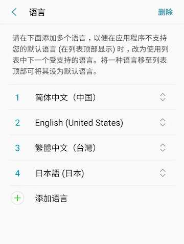

# 13.1 Let the App support multiple languages

If our application is to support multiple languages, then we need to "internationalize" it. This means that we need to set some "localized" values, such as text and layout, for each language environment supported by the application during development. The Flutter SDK has provided some components and classes to help us achieve internationalization. Let's introduce the steps to achieve internationalization in Flutter.

Next, we use the `MaterialApp`class as the entry application to illustrate how to support internationalization.

> Most applications are passed `MaterialApp`as the entrance, but `WidgetsApp`applications written according to the low-level classes as the entrance can also use the same classes and logic for internationalization. `MaterialApp`It is actually `WidgetsApp`a package.

Note that "localized values ​​and resources" refer to the different resources we prepare for different languages. These resources generally refer to copywriting (strings). Of course, there are also some other resources that vary according to different language regions, such as our We need to display a national flag picture on the app store, so we need to provide different national flag pictures for different Locale regions.

### Support internationalization

By default, the components in the Flutter SDK only provide U.S. English localized resources (mainly text). To add support for other languages, the application must add a package dependency called "flutter_localizations", and then need `MaterialApp`to do some configuration in it. To use the `flutter_localizations`package, you first need to add dependencies to the `pubspec.yaml`file:

``` dart 
dependencies:
 flutter:
   sdk: flutter
 flutter_localizations:
   sdk: flutter

```

Next, download the `flutter_localizations`library, and then specify `MaterialApp`the `localizationsDelegates`sum `supportedLocales`:

``` dart 
import 'package:flutter_localizations/flutter_localizations.dart';

new MaterialApp(
localizationsDelegates: [
  // 本地化的代理类
  GlobalMaterialLocalizations.delegate,
  GlobalWidgetsLocalizations.delegate,
],
supportedLocales: [
   const Locale('en', 'US'), // 美国英语
   const Locale('zh', 'CN'), // 中文简体
   //其它Locales
 ],
 // ...
)

```

> And `MaterialApp`class of entry for different applications, based `WidgetsApp`upon the class of the international application entry is not required `GlobalMaterialLocalizations.delegate`.

`localizationsDelegates`The elements in the list are factories that generate sets of localized values. `GlobalMaterialLocalizations.delegate`It provides localized strings and other values ​​for the Material component library, which enables the Material component to support multiple languages. `GlobalWidgetsLocalizations.delegate`Define the default text direction of the component, from left to right or from right to left. This is because the reading habit of some languages ​​is not from left to right, for example, Arabic is from right to left.

`supportedLocales`It also receives an array of Locale, which represents a list of languages ​​supported by our application. In this example, our application only supports two languages: US English and Simplified Chinese.

### Get the current area Locale

[`Locale`](https://docs.flutter.io/flutter/dart-ui/Locale-class.html)The class is used to identify the user's locale. It includes two flags, language and country, such as:

``` dart 
const Locale('zh', 'CN') // 中文简体

```

We can always get the current locale of the application in the following ways:

``` dart 
Locale myLocale = Localizations.localeOf(context);

```

[`Localizations`](https://docs.flutter.io/flutter/widgets/Localizations-class.html)The component is generally located at the top of other business components in the widget tree. Its function is to define the locale of the area and set the localized resources that the subtree depends on. If the language environment of the system changes, [WidgetsApp](https://docs.flutter.io/flutter/widgets/WidgetsApp-class.html) will create a new Localizations component and rebuild it, so that `Localizations.localeOf(context)`the Locale obtained through the subtree will be updated.

### Monitor system language switch

When we change the system language setting, the Localizations component in the APP will be rebuilt, the `Localizations.localeOf(context)`obtained Locale will be updated, and finally the interface will be rebuilt to achieve the effect of switching languages. But this process is done implicitly. We did not actively monitor the system language switch, but sometimes we need to do something when the system language changes. For example, when the system language is switched to a language that our APP does not support, we need Set a default language, then we need to listen for locale change events.

We can monitor the locale change event through `localeResolutionCallback`or `localeListResolutionCallback`callback, let’s take a look at `localeResolutionCallback`the callback function signature:

``` dart 
Locale Function(Locale locale, Iterable<Locale> supportedLocales)

```

-   The parameter `locale`value is the current current system language setting. This locale is the current locale of the system when the application starts or the user dynamically changes the system language setting. When the developer manually specifies the locale of the APP, then this locale parameter represents the locale specified by the developer, and the system locale will be ignored at this time, such as:
   
``` dart 
   MaterialApp(
    ...
    locale: const Locale('en', 'US'), //手动指定locale
    ...
   )
   
```
   
   In the above example, the application locale is manually designated as American English. Even if the current language of the device is simplified Chinese, the locale in the application will still be American English. If it `locale`is `null`, it means that Flutter has not been able to obtain the locale information of the device, so we `locale`must first empty it before using it.
   
-   `supportedLocales`The list of locales supported for the current application is `supportedLocales`registered by the developer through attributes in MaterialApp .
   
-   The return value is one `Locale`, which `Locale`is ultimately used by the Flutter APP `Locale`. Usually a default is returned when the locale is not supported `Locale`.
   

`localeListResolutionCallback`The `localeResolutionCallback`only difference is in the first parameter type. The former receives a `Locale`list, while the latter receives a single `Locale`.

``` dart 
Locale Function(List<Locale> locales, Iterable<Locale> supportedLocales)

```

In the newer Android system, the user can set a language list. In this way, applications that support multiple languages ​​will get this list. The usual processing method for applications is to try to load the corresponding Locale in the order of the list. If the languages ​​are loaded successfully, it will stop. Figure 13-1 is a screenshot of the language list in the Android system:



In Flutter, it should be used first `localeListResolutionCallback`. Of course, you don't have to worry about the differences in the Android system. If in a lower version of the Android system, Flutter will automatically handle this situation. At this time, the Locale list will only contain one item.

### Localization component

The Localizations component is used to load and find localized values ​​or resources in the current language of the application. The application [`Localizations.of(context,type)`](https://docs.flutter.io/flutter/widgets/Localizations/of.html)refers to these objects through. If the locale setting of the device is changed, the Localizations component will automatically load the Locale value of the new area, and then rebuild the components that use (depend on) them. This happens because `Localizations`the [InheritedWidget](https://book.flutterchina.club/chapter7/inherited_widget.html) is used internally , and we are introducing the component I have said that when the `build`function of the sub-component is referenced `InheritedWidget`, it will create a right `InheritedWidget`implicit dependency. Therefore, when `InheritedWidget`there is a change, that is, when `Localizations`the Locale setting changes, all child components that depend on it will be rebuilt.

The localization value is loaded from `Localizations`the [LocalizationsDelegates](https://docs.flutter.io/flutter/widgets/LocalizationsDelegate-class.html) list. **Each delegate must define an asynchronous load() method** to generate an object that encapsulates a series of localized values. Usually these objects define a method for each localized value.

In large applications, different modules or packages may be bundled with their own localized values. This is why the `Localizations`management object table is used . To use an object produced by one `LocalizationsDelegate`of the `load`methods, you can specify a `BuildContext`and object type to find it. For example, the localized strings of the Material component library are defined by the [MaterialLocalizations](https://docs.flutter.io/flutter/material/MaterialLocalizations-class.html) class, and the instances of this class are created by the [MaterialApp](https://docs.flutter.io/flutter/material/MaterialApp-class.html) class `LocalizationDelegate`. They can be obtained as follows:

``` dart 
Localizations.of<MaterialLocalizations>(context, MaterialLocalizations);

```

This special `Localizations.of()`expression will be used often, so the MaterialLocalizations class provides a convenience method:

``` dart 
static MaterialLocalizations of(BuildContext context) {
 return Localizations.of<MaterialLocalizations>(context, MaterialLocalizations);
}

// 可以直接调用便捷方法
tooltip: MaterialLocalizations.of(context).backButtonTooltip,

```

### Use packaged LocalizationsDelegates

In order to be as small and simple as possible, the flutter package only provides implementations of American English values `MaterialLocalizations`and `WidgetsLocalizations`interfaces. These implementation classes are called `DefaultMaterialLocalizations`and respectively `DefaultWidgetsLocalizations`. flutter_localizations package contains `GlobalMaterialLocalizations`and `GlobalWidgetsLocalizations`localized multi-language interface, an international application must state in accordance with the beginning of this section, as designated localized Delegate for these classes.

The above `GlobalMaterialLocalizations`sum `GlobalWidgetsLocalizations`is only the localized implementation of the Material component library. If we want our layout to support multiple languages, then we need to implement it soon `Localizations`. We will introduce its specific implementation in the next section.