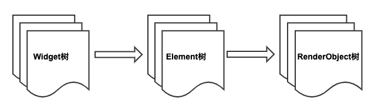
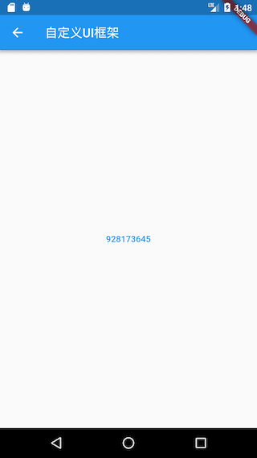

# 14.2 Element与BuildContext

## 14.2.1 Element

In the "Introduction to Widget" section, we introduced the relationship between Widget and Element. We know that the final UI tree is actually composed of individual Element nodes. We also said that the final layout and rendering of the component are `RenderObject`completed through the process from creation to rendering: Generate Element according to Widget, then create the corresponding `RenderObject`and associate it with the `Element.renderObject`attribute, and finally `RenderObject`complete the layout and drawing through .

Element is an instantiated object of Widget at a specific location in the UI tree. Most Elements are only unique `renderObject`, but some Elements have multiple child nodes, such as `RenderObjectElement`some classes inherited from `MultiChildRenderObjectElement`. In the end, all the RenderObjects of the Element form a tree, which we call "Render Tree" or "render tree". To sum up, we can think that Flutter's UI system contains three trees: Widget tree, Element tree, and rendering tree. Their dependency relationship is: Element tree is generated based on Widget tree, and rendering tree depends on Element tree, as shown in Figure 14-0.



Now let’s focus on Element. The life cycle of Element is as follows:

1.  Framework call `Widget.createElement`creates an instance of Element, denoted as`element`
2.  Framework call `element.mount(parentElement,newSlot)`, the mount method first calls `element`the method of the corresponding Widget to `createRenderObject`create the `element`associated RenderObject object, and then calls the `element.attachRenderObject`method to `element.renderObject`add it to the position specified by the slot in the render tree (this step is not necessary, generally occurs when the Element tree structure changes Only then need to reattach). After being inserted into the render tree, `element`it is in the "active" state, and after being in the "active" state, it can be displayed on the screen (can be hidden).
3.  When the configuration data of the parent Widget changes, and the `State.build`returned Widget structure is different from before, the corresponding Element tree needs to be rebuilt at this time. In order to reuse the Element, it will try to reuse the element at the same position on the old tree before the Element is rebuilt. The element node will call the `canUpdate`method of its corresponding Widget before updating . If it returns `true`, the old Element will be reused. Element will be updated with the new Widget configuration data, otherwise it will create a new Element. `Widget.canUpdate`The main is to determine `newWidget`with `oldWidget`the `runtimeType`and `key`equality at the same time, if both are equal returns `true`, otherwise it will return `false`. According to this principle, when we need to forcibly update a Widget, we can avoid reuse by specifying a different Key.
4.  When an ancestor Element decides to remove `element`(for example, the Widget tree structure has changed, causing the `element`corresponding Widget to be removed), then the ancestor Element will call the `deactivateChild`method to remove it, and it `element.renderObject`will be removed from the rendering tree after removal. Then the Framework will call the `element.deactivate`method, and the `element`state will become "inactive".
5.  Elements in the "inactive" state will no longer be displayed on the screen. In order to avoid repeated creation and removal of a specific element during the execution of an animation, the element in the "inactive" state will be retained until the end of the last frame of the current animation. If it fails to become "active again after the execution of the animation," "State, the Framework will call its `unmount`method to completely remove it. At this time, the state of the element is `defunct`that it will never be inserted into the tree again.
6.  If you `element`want to re-insert it to another location in the Element tree, for example , the ancestor of `element`or `element`has a GlobalKey (used for global reuse of elements), then Framework will first remove the element from the existing location, and then call its `activate`method, and `renderObject`re Attach to the render tree.

After reading the life cycle of the Element, some readers may have questions. Will developers directly manipulate the Element tree? In fact, for developers, in most cases, they only need to pay attention to the Widget tree. The Flutter framework has mapped the operations on the Widget tree to the Element tree, which can greatly reduce complexity and improve development efficiency. However, understanding Element is crucial to understanding the entire Flutter UI framework. Flutter links Widget and RenderObject through the link of Element. Understanding the Element layer will not only help readers have a clear understanding of the Flutter UI framework, but also improve Own abstraction ability and design ability. In addition, in some cases, we have to directly use the Element object to complete some operations, such as getting theme data. The specific details will be introduced below.

## 14.2.2 BuildContext

We already know, `StatelessWidget`and `StatefulWidget`the `build`method will pass a `BuildContext`target:

``` dart 
Widget build(BuildContext context) {}

```

We also know that in many cases we need to use this to `context`do something, such as:

``` dart 
Theme.of(context) //获取主题
Navigator.push(context, route) //入栈新路由
Localizations.of(context, type) //获取Local
context.size //获取上下文大小
context.findRenderObject() //查找当前或最近的一个祖先RenderObject

```

So `BuildContext`what is it? Check its definition and find that it is an abstract interface class:

``` dart 
abstract class BuildContext {
   ...
}

```

So `context`who is the implementation class corresponding to this object? We follow it, find `build`invocation occurs `StatelessWidget`and `StatefulWidget`the corresponding `StatelessElement`and `StatefulElement`the `build`methods for `StatelessElement`example:

``` dart 

class StatelessElement extends ComponentElement {
 ...
 @override
 Widget build() => widget.build(this);
 ...
}

```

Found `build`that the parameters passed `this`is obvious! This `BuildContext`is it `StatelessElement`. Similarly, we also found `StatefulWidget`the `context`Shi `StatefulElement`. However, `StatelessElement`and `StatefulElement`in itself it does not implement `BuildContext`the interface, continue to follow the code, find that they indirectly inherited from `Element`class, and then view the `Element`class definitions and found that `Element`class really implements `BuildContext`the interface:

``` dart 
class Element extends DiagnosticableTree implements BuildContext {
   ...
}

```

At this point the truth, `BuildContext`is the corresponding widget `Element`, so we can pass `context`in `StatelessWidget`and `StatefulWidget`the `build`access method direct `Element`object. The `Theme.of(context)`element `dependOnInheritedWidgetOfExactType()`method is called inside the code that we get the theme data .

> Question: Why are the parameters of the build method not defined as Element objects, but as BuildContext?

### Advanced

We can see inside Flutter UI Element is connected to the frame widget and `RenderObject`ties, most of the time developers only need to focus widget layer can be, but the widget layer sometimes can not completely shield `Element`the details, so in the Framework `StatelessWidget`and `StatefulWidget`by the `build`method parameters in turn `Element`The object is also passed to the developer, so that the developer can directly manipulate the `Element`object when needed . So now the author asks two questions, please think about it for yourself first:

1.  If there is no widget layer, `Element`can a usable UI framework be built on the layer alone ? What if it can be?
2.  Can the Flutter UI framework not be made responsive?

For question 1, the answer is of course yes, because we said before that the widget tree is just a `Element`tree mapping, and we can build a UI framework directly through Element. Here is an example:

We use pure Element to simulate `StatefulWidget`the function of one. Suppose there is a page with a button. The text of the button is a 9-digit number. Click the button once, and the 9 numbers will be sorted randomly. The code is as follows:

``` dart 
class HomeView extends ComponentElement{
 HomeView(Widget widget) : super(widget);
 String text = "123456789";

 @override
 Widget build() {
   Color primary=Theme.of(this).primaryColor; //1
   return GestureDetector(
     child: Center(
       child: FlatButton(
         child: Text(text, style: TextStyle(color: primary),),
         onPressed: () {
           var t = text.split("")..shuffle();
           text = t.join();
           markNeedsBuild(); //点击后将该Element标记为dirty，Element将会rebuild
         },
       ),
     ),
   );
 }
}

```

-   The above `build`method does not receive parameters, and in that `StatelessWidget`and `StatefulWidget`in `build(BuildContext)`different ways. Just use `BuildContext`the place where you need to use it in the code. For `this`example, the `Theme.of(this)`parameter in code comment 1 can be passed directly `this`, because the current object itself is an `Element`instance.
-   When `text`there is a change, we can call the `markNeedsBuild()`method to mark the current Element as dirty, and the element marked as dirty will be rebuilt in the next frame. In fact, `State.setState()`the `markNeedsBuild()`method is called internally .
   
-   The build method in the above code still returns a widget. This is because there is already a widget layer in the Flutter framework, and the component library is already provided in the form of widgets. If all the components in the Flutter framework are like the example Provided in the `HomeView`same `Element`form, then the return value type of the build method can be used `Element`to build the UI purely .`HomeView``Element`
   

If we need to run the above code in the existing Flutter framework, we still have to provide an "adapter" widget to `HomeView`integrate into the existing framework. The following `CustomHome`is equivalent to the "adapter":

``` dart 
class CustomHome extends Widget {
 @override
 Element createElement() {
   return HomeView(this);
 }
}

```

Now you can `CustomHome`add it to the widget tree. We create it on a new routing page. The final effect is as shown in Figure 14-1 and 14-2 (after clicking):

  

Click the button and the button text will be sorted randomly.

For question 2, the answer is of course yes. The dart API provided by the Flutter engine is primitive and independent. This is similar to the API provided by the operating system. The design of the upper UI framework depends entirely on the designer, and the UI framework can be designed. Android style or iOS style, but Google will not do these things again, and we don’t need to do this again. This is because the responsive thinking itself is great. The reason for asking this question is because of the author. It is one thing to think that it is one thing to do or not to do, but it is another thing to know whether it can be done or not, which reflects our understanding of knowledge.

### to sum up

This section introduces the `Element`life cycle in detail , as well as the relationship between Widget and BuildContext, and also introduces the role and function of Element in the Flutter UI system. We will introduce another important role in the Flutter UI system, RenderObject in the next section.