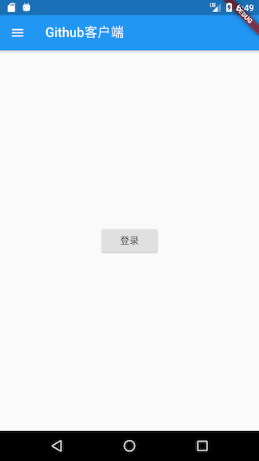
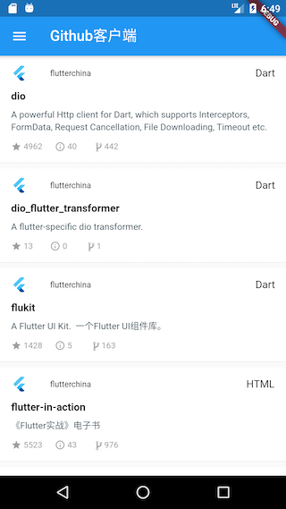
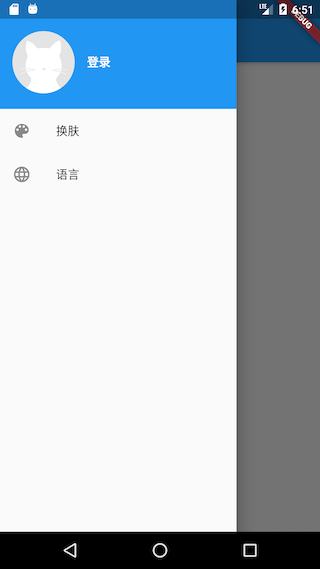
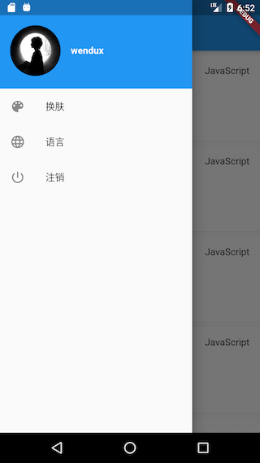

# 15.6 APP entrance and homepage

This section introduces the APP entrance and homepage.

## 15.6.1 APP entry

`main`The function is the APP entry function, which is implemented as follows:

``` dart 
void main() => Global.init().then((e) => runApp(MyApp()));

```

The UI ( `MyApp`) will be loaded after the initialization is complete , which `MyApp`is the entry Widget of the application, and is implemented as follows:

``` dart 
class MyApp extends StatelessWidget {
 // This widget is the root of your application.
 @override
 Widget build(BuildContext context) {
   return MultiProvider(
     providers: <SingleChildCloneableWidget>[
       ChangeNotifierProvider.value(value: ThemeModel()),
       ChangeNotifierProvider.value(value: UserModel()),
       ChangeNotifierProvider.value(value: LocaleModel()),
     ],
     child: Consumer2<ThemeModel, LocaleModel>(
       builder: (BuildContext context, themeModel, localeModel, Widget child) {
         return MaterialApp(
           theme: ThemeData(
             primarySwatch: themeModel.theme,
           ),
           onGenerateTitle: (context){
             return GmLocalizations.of(context).title;
           },
           home: HomeRoute(), //应用主页
           locale: localeModel.getLocale(),
           //我们只支持美国英语和中文简体
           supportedLocales: [
             const Locale('en', 'US'), // 美国英语
             const Locale('zh', 'CN'), // 中文简体
             //其它Locales
           ],
           localizationsDelegates: [
             // 本地化的代理类
             GlobalMaterialLocalizations.delegate,
             GlobalWidgetsLocalizations.delegate,
             GmLocalizationsDelegate()
           ],
           localeResolutionCallback:
               (Locale _locale, Iterable<Locale> supportedLocales) {
             if (localeModel.getLocale() != null) {
               //如果已经选定语言，则不跟随系统
               return localeModel.getLocale();
             } else {

               Locale locale;
               //APP语言跟随系统语言，如果系统语言不是中文简体或美国英语，
               //则默认使用美国英语
               if (supportedLocales.contains(_locale)) {
                 locale= _locale;
               } else {
                 locale= Locale('en', 'US');
               }
               return locale;
             }
           },
           // 注册命名路由表
           routes: <String, WidgetBuilder>{
             "login": (context) => LoginRoute(),
             "themes": (context) => ThemeChangeRoute(),
             "language": (context) => LanguageRoute(),
           },
         );
       },
     ),
   );
 }
}

```

In the code above:

1.  Our root widget is `MultiProvider`that it binds the three states of theme, user, and language to the root of the application. In this way, any route can be `Provider.of()`used to obtain these states, which means that these three states are globally shared!
2.  `HomeRoute`It is the homepage of the application.
3.  When building `MaterialApp`, we configured the language list supported by the APP and listened to the system language change event; in addition `MaterialApp`, the `ThemeModel`sum was consumed (dependent) `LocaleModel`, so when the APP theme or language changes, it `MaterialApp`will be rebuilt
4.  We have registered a named routing table so that we can jump directly through the routing name in the APP.
5.  In order to support multiple languages ​​(in this APP, we support two languages, American English and Chinese simplified), we have implemented one `GmLocalizationsDelegate`, and all sub-Widgets can `GmLocalizations`dynamically obtain the copy corresponding to the current language of the APP. For the implementation of `GmLocalizationsDelegate`sum `GmLocalizations`, readers can refer to the introduction in the chapter "Internationalization", which will not be repeated here.

## 15.6.2 Home

For the sake of simplicity, when the app is started, if you have logged in to the app before, the user project list will be displayed; if you have not logged in before, a login button will be displayed, click it and jump to the login page. In addition, we implement a drawer menu, which contains the current user avatar and APP menu. Let's take a look at the effects to be achieved first, as shown in Figures 15-1 and 15-2:



We create a "home_page.dart" file under "lib/routes", the implementation is as follows:

``` dart 
class HomeRoute extends StatefulWidget {
 @override
 _HomeRouteState createState() => _HomeRouteState();
}

class _HomeRouteState extends State<HomeRoute> {
 @override
 Widget build(BuildContext context) {
   return Scaffold(
     appBar: AppBar(
       title: Text(GmLocalizations.of(context).home),
     ),
     body: _buildBody(), // 构建主页面
     drawer: MyDrawer(), //抽屉菜单
   );
 }
 ...// 省略
}

```

The above code, the page title (title) we are through `GmLocalizations.of(context).home`to get, `GmLocalizations`is that we provide a `Localizations`class for multi-language support, so that when APP language change, those who use `GmLocalizations`dynamic copy obtained will be the corresponding language copywriting, this It has been introduced in the previous chapter "Internationalization", readers can refer to it.

We `_buildBody()`constructed the home page content method, `_buildBody()`method codes are as follows:

``` dart 
 Widget _buildBody() {
   UserModel userModel = Provider.of<UserModel>(context);
   if (!userModel.isLogin) {
     //用户未登录，显示登录按钮
     return Center(
       child: RaisedButton(
         child: Text(GmLocalizations.of(context).login),
         onPressed: () => Navigator.of(context).pushNamed("login"),
       ),
     );
   } else {
     //已登录，则展示项目列表
     return InfiniteListView<Repo>(
       onRetrieveData: (int page, List<Repo> items, bool refresh) async {
         var data = await Git(context).getRepos(
           refresh: refresh,
           queryParameters: {
             'page': page,
             'page_size': 20,
           },
         );
         //把请求到的新数据添加到items中
         items.addAll(data); 
         // 如果接口返回的数量等于'page_size'，则认为还有数据，反之则认为最后一页
         return data.length==20;
       },
       itemBuilder: (List list, int index, BuildContext ctx) {
         // 项目信息列表项
         return RepoItem(list[index]);
       },
     );
   }
 }
}

```

The above code comments are very clear: if the user is not logged in, the login button is displayed; if the user is logged in, the project list is displayed. The list of items here uses `InfiniteListView`Widget, which is provided in the flukit package. `InfiniteListView`At the same time, it supports pull-down refresh and pull-up loading more functions. `onRetrieveData`For data acquisition callback, the callback function receives three parameters:

parameter name

Types of

Explanation

page

int

Current page number

items

List

List to save the current list data

refresh

bool

Whether it is a pull-down refresh trigger

Return type `bool`, as `true`represented by the data as well, is `false`when there is no subsequent data indicates the. `onRetrieveData`In the callback, we call `Git(context).getRepos(...)`to get a list of user projects, and at the same time specify to get 20 items per request. When the acquisition is successful, first add the newly acquired item data to `items`it, and then determine whether there is more data based on whether the number of items requested this time is equal to the expected 20 items. It should be noted that the `Git(context).getRepos(…)`method requires `refresh`parameters to determine whether to use the cache.

`itemBuilder`For the builder of list items, we need to build each list item Widget in this callback. Since the list item construction logic is more complicated, we encapsulate a `RepoItem`Widget specifically for building the list item UI. `RepoItem`The implementation is as follows:

``` dart 
import '../index.dart';

class RepoItem extends StatefulWidget {
 // 将`repo.id`作为RepoItem的默认key
 RepoItem(this.repo) : super(key: ValueKey(repo.id));

 final Repo repo;

 @override
 _RepoItemState createState() => _RepoItemState();
}

class _RepoItemState extends State<RepoItem> {
 @override
 Widget build(BuildContext context) {
   var subtitle;
   return Padding(
     padding: const EdgeInsets.only(top: 8.0),
     child: Material(
       color: Colors.white,
       shape: BorderDirectional(
         bottom: BorderSide(
           color: Theme.of(context).dividerColor,
           width: .5,
         ),
       ),
       child: Padding(
         padding: const EdgeInsets.only(top: 0.0, bottom: 16),
         child: Column(
           crossAxisAlignment: CrossAxisAlignment.start,
           children: <Widget>[
             ListTile(
               dense: true,
               leading: gmAvatar(
                 //项目owner头像
                 widget.repo.owner.avatar_url,
                 width: 24.0,
                 borderRadius: BorderRadius.circular(12),
               ),
               title: Text(
                 widget.repo.owner.login,
                 textScaleFactor: .9,
               ),
               subtitle: subtitle,
               trailing: Text(widget.repo.language ?? ""),
             ),
             // 构建项目标题和简介
             Padding(
               padding: const EdgeInsets.symmetric(horizontal: 16.0),
               child: Column(
                 crossAxisAlignment: CrossAxisAlignment.start,
                 children: <Widget>[
                   Text(
                     widget.repo.fork
                         ? widget.repo.full_name
                         : widget.repo.name,
                     style: TextStyle(
                       fontSize: 15,
                       fontWeight: FontWeight.bold,
                       fontStyle: widget.repo.fork
                           ? FontStyle.italic
                           : FontStyle.normal,
                     ),
                   ),
                   Padding(
                     padding: const EdgeInsets.only(top: 8, bottom: 12),
                     child: widget.repo.description == null
                         ? Text(
                             GmLocalizations.of(context).noDescription,
                             style: TextStyle(
                                 fontStyle: FontStyle.italic,
                                 color: Colors.grey[700]),
                           )
                         : Text(
                             widget.repo.description,
                             maxLines: 3,
                             style: TextStyle(
                               height: 1.15,
                               color: Colors.blueGrey[700],
                               fontSize: 13,
                             ),
                           ),
                   ),
                 ],
               ),
             ),
             // 构建卡片底部信息
             _buildBottom()
           ],
         ),
       ),
     ),
   );
 }

 // 构建卡片底部信息
 Widget _buildBottom() {
   const paddingWidth = 10;
   return IconTheme(
     data: IconThemeData(
       color: Colors.grey,
       size: 15,
     ),
     child: DefaultTextStyle(
       style: TextStyle(color: Colors.grey, fontSize: 12),
       child: Padding(
         padding: const EdgeInsets.symmetric(horizontal: 16),
         child: Builder(builder: (context) {
           var children = <Widget>[
             Icon(Icons.star),
             Text(" " +
                 widget.repo.stargazers_count
                     .toString()
                     .padRight(paddingWidth)),
             Icon(Icons.info_outline),
             Text(" " +
                 widget.repo.open_issues_count
                     .toString()
                     .padRight(paddingWidth)),

             Icon(MyIcons.fork), //我们的自定义图标
             Text(widget.repo.forks_count.toString().padRight(paddingWidth)),
           ];

           if (widget.repo.fork) {
             children.add(Text("Forked".padRight(paddingWidth)));
           }

           if (widget.repo.private == true) {
             children.addAll(<Widget>[
               Icon(Icons.lock),
               Text(" private".padRight(paddingWidth))
             ]);
           }
           return Row(children: children);
         }),
       ),
     ),
   );
 }
}

```

There are two points to note in the above code:

1.  `gmAvatar(…)`The method is called when the project owner's avatar is constructed . This method is a global tool function, specifically used to obtain the avatar image. The implementation is as follows:
   
``` dart 
   Widget gmAvatar(String url, {
     double width = 30,
     double height,
     BoxFit fit,
     BorderRadius borderRadius,
   }) {
     var placeholder = Image.asset(
         "imgs/avatar-default.png", //头像占位图，加载过程中显示
         width: width,
         height: height
     );
     return ClipRRect(
       borderRadius: borderRadius ?? BorderRadius.circular(2),
       child: CachedNetworkImage( 
         imageUrl: url,
         width: width,
         height: height,
         fit: fit,
         placeholder: (context, url) =>placeholder,
         errorWidget: (context, url, error) =>placeholder,
       ),
     );
   }
   
```
   
   The code called `CachedNetworkImage`is a Widget provided in the cached_network_image package. It can not only specify a placeholder image during the image loading process, but also cache the image requested by the network. For more details, readers can consult its documentation.
   
2.  Since there is no fork icon in Flutter's Material icon library, we found a fork icon on iconfont.cn and integrated it into our project according to the method of using custom font icons introduced in the "Pictures and Icons" section.
   

## 15.6.3 Drawer menu

The drawer menu is divided into two parts: the top avatar and the bottom function menu items. When the user is not logged in, a default gray placeholder will be displayed at the top of the drawer menu. If the user is logged in, the user's avatar will be displayed. There are two fixed menus, "Skin" and "Language" at the bottom of the drawer menu. If the user is logged in, there will be an additional "Logout" menu. The user clicks on the two menu items "skin" and "language" to enter the corresponding setting page. The effect of our drawer menu is shown in Figure 15-3 and 15-4:



The implementation code is as follows:

``` dart 
class MyDrawer extends StatelessWidget {
 const MyDrawer({
   Key key,
 }) : super(key: key);

 @override
 Widget build(BuildContext context) {
   return Drawer(
     //移除顶部padding
     child: MediaQuery.removePadding(
       context: context,
       removeTop: true,
       child: Column(
         crossAxisAlignment: CrossAxisAlignment.start,
         children: <Widget>[
           _buildHeader(), //构建抽屉菜单头部
           Expanded(child: _buildMenus()), //构建功能菜单
         ],
       ),
     ),
   );
 }

 Widget _buildHeader() {
   return Consumer<UserModel>(
     builder: (BuildContext context, UserModel value, Widget child) {
       return GestureDetector(
         child: Container(
           color: Theme.of(context).primaryColor,
           padding: EdgeInsets.only(top: 40, bottom: 20),
           child: Row(
             children: <Widget>[
               Padding(
                 padding: const EdgeInsets.symmetric(horizontal: 16.0),
                 child: ClipOval(
                   // 如果已登录，则显示用户头像；若未登录，则显示默认头像
                   child: value.isLogin
                       ? gmAvatar(value.user.avatar_url, width: 80)
                       : Image.asset(
                           "imgs/avatar-default.png",
                           width: 80,
                         ),
                 ),
               ),
               Text(
                 value.isLogin
                     ? value.user.login
                     : GmLocalizations.of(context).login,
                 style: TextStyle(
                   fontWeight: FontWeight.bold,
                   color: Colors.white,
                 ),
               )
             ],
           ),
         ),
         onTap: () {
           if (!value.isLogin) Navigator.of(context).pushNamed("login");
         },
       );
     },
   );
 }

 // 构建菜单项
 Widget _buildMenus() {
   return Consumer<UserModel>(
     builder: (BuildContext context, UserModel userModel, Widget child) {
       var gm = GmLocalizations.of(context);
       return ListView(
         children: <Widget>[
           ListTile(
             leading: const Icon(Icons.color_lens),
             title: Text(gm.theme),
             onTap: () => Navigator.pushNamed(context, "themes"),
           ),
           ListTile(
             leading: const Icon(Icons.language),
             title: Text(gm.language),
             onTap: () => Navigator.pushNamed(context, "language"),
           ),
           if(userModel.isLogin) ListTile(
             leading: const Icon(Icons.power_settings_new),
             title: Text(gm.logout),
             onTap: () {
               showDialog(
                 context: context,
                 builder: (ctx) {
                   //退出账号前先弹二次确认窗
                   return AlertDialog(
                     content: Text(gm.logoutTip),
                     actions: <Widget>[
                       FlatButton(
                         child: Text(gm.cancel),
                         onPressed: () => Navigator.pop(context),
                       ),
                       FlatButton(
                         child: Text(gm.yes),
                         onPressed: () {
                           //该赋值语句会触发MaterialApp rebuild
                           userModel.user = null;
                           Navigator.pop(context);
                         },
                       ),
                     ],
                   );
                 },
               );
             },
           ),
         ],
       );
     },
   );
 }
}

```

When the user clicks "Logout", it `userModel.user`will be blank. At this time, all dependent `userModel`components will be `rebuild`deleted. For example, the homepage will be restored to an unlogged state.

In this section, we introduced `MaterialApp`some configurations of the APP entry , and then implemented the APP home page. Later we will show the login page, skin page and language switching page.