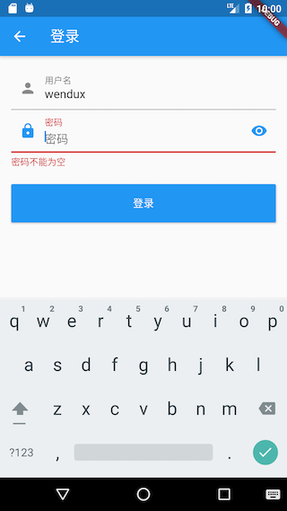

# 15.7 Login page

We said that Github has multiple login methods. For the sake of simplicity, we only implement login with username and password. There are four points to note when implementing the login page:

1.  The user name of the last login (if any) can be automatically filled.
2.  In order to prevent wrong password input, the password box should have a switch to see the plain text.
3.  The user name or password field has a local legality check (for example, it cannot be empty) before calling the login interface.
4.  User information needs to be updated after successful login.

The implementation code is as follows:

``` dart 
import '../index.dart';

class LoginRoute extends StatefulWidget {
 @override
 _LoginRouteState createState() => _LoginRouteState();
}

class _LoginRouteState extends State<LoginRoute> {
 TextEditingController _unameController = new TextEditingController();
 TextEditingController _pwdController = new TextEditingController();
 bool pwdShow = false; //密码是否显示明文
 GlobalKey _formKey = new GlobalKey<FormState>();
 bool _nameAutoFocus = true;

 @override
 void initState() {
   // 自动填充上次登录的用户名，填充后将焦点定位到密码输入框
   _unameController.text = Global.profile.lastLogin;
   if (_unameController.text != null) {
     _nameAutoFocus = false;
   }
   super.initState();
 }

 @override
 Widget build(BuildContext context) {
   var gm = GmLocalizations.of(context);
   return Scaffold(
     appBar: AppBar(title: Text(gm.login)),
     body: Padding(
       padding: const EdgeInsets.all(16.0),
       child: Form(
         key: _formKey,
         autovalidate: true,
         child: Column(
           children: <Widget>[
             TextFormField(
                 autofocus: _nameAutoFocus,
                 controller: _unameController,
                 decoration: InputDecoration(
                   labelText: gm.userName,
                   hintText: gm.userNameOrEmail,
                   prefixIcon: Icon(Icons.person),
                 ),
                 // 校验用户名（不能为空）
                 validator: (v) {
                   return v.trim().isNotEmpty ? null : gm.userNameRequired;
                 }),
             TextFormField(
               controller: _pwdController,
               autofocus: !_nameAutoFocus,
               decoration: InputDecoration(
                   labelText: gm.password,
                   hintText: gm.password,
                   prefixIcon: Icon(Icons.lock),
                   suffixIcon: IconButton(
                     icon: Icon(
                         pwdShow ? Icons.visibility_off : Icons.visibility),
                     onPressed: () {
                       setState(() {
                         pwdShow = !pwdShow;
                       });
                     },
                   )),
               obscureText: !pwdShow,
               //校验密码（不能为空）
               validator: (v) {
                 return v.trim().isNotEmpty ? null : gm.passwordRequired;
               },
             ),
             Padding(
               padding: const EdgeInsets.only(top: 25),
               child: ConstrainedBox(
                 constraints: BoxConstraints.expand(height: 55.0),
                 child: RaisedButton(
                   color: Theme.of(context).primaryColor,
                   onPressed: _onLogin,
                   textColor: Colors.white,
                   child: Text(gm.login),
                 ),
               ),
             ),
           ],
         ),
       ),
     ),
   );
 }

 void _onLogin() async {
   // 提交前，先验证各个表单字段是否合法
   if ((_formKey.currentState as FormState).validate()) {
     showLoading(context);
     User user;
     try {
       user = await Git(context).login(_unameController.text, _pwdController.text);
       // 因为登录页返回后，首页会build，所以我们传false，更新user后不触发更新
       Provider.of<UserModel>(context, listen: false).user = user;
     } catch (e) {
       //登录失败则提示
       if (e.response?.statusCode == 401) {
         showToast(GmLocalizations.of(context).userNameOrPasswordWrong);
       } else {
         showToast(e.toString());
       }
     } finally {
       // 隐藏loading框
       Navigator.of(context).pop();
     }
     if (user != null) {
       // 返回
       Navigator.of(context).pop();
     }
   }
 }
}

```

The code is very simple, there are comments in key places, so I won't repeat them. Let's take a look at the running effect, as shown in Figure 15-5.

