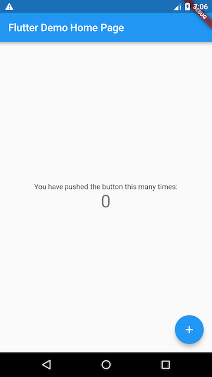

# 2.1 Counter application example

The Flutter application template created with Android Studio and VS Code is a simple counter example by default. This section first carefully explains the source code of this counter Demo, so that readers have a basic understanding of the structure of the Flutter application, and then based on this example in the following sections, some new functions will be added step by step to introduce other concepts of the Flutter application. And technology.

For the following examples, I hope that readers can follow the author to write them by hand. This will not only deepen the impression, but also have a real experience of the concepts and techniques introduced. If you are not very familiar with the Dart language or have no mobile development experience, don't worry, as long as you are familiar with object-oriented and basic programming concepts (such as variables, loops, and conditional control), you can complete this example.

## 2.1.1 Create Flutter application template

Create a new Flutter project via Android Studio or VS Code and name it "first_flutter_app". After creating it, you will get a demo of the counter application.

> Note that the default Demo example may change with the version of the editor Flutter plug-in. This example will introduce all the code of the counter example, so it will not affect this example.

We first run the created project, the effect is shown in Figure 2-1:



In this counter example, every time you click the floating button with a "+" sign in the lower right corner, the number in the center of the screen will increase by 1.

In this example, the main Dart code is in the **lib/main.dart** file. Here is its source code:

``` dart 
import 'package:flutter/material.dart';

void main() => runApp(new MyApp());

class MyApp extends StatelessWidget {
 @override
 Widget build(BuildContext context) {
   return new MaterialApp(
     title: 'Flutter Demo',
     theme: new ThemeData(
       primarySwatch: Colors.blue,
     ),
     home: new MyHomePage(title: 'Flutter Demo Home Page'),
   );
 }
}

class MyHomePage extends StatefulWidget {
 MyHomePage({Key key, this.title}) : super(key: key);
 final String title;

 @override
 _MyHomePageState createState() => new _MyHomePageState();
}

class _MyHomePageState extends State<MyHomePage> {
 int _counter = 0;

 void _incrementCounter() {
   setState(() {
     _counter++;
   });
 }

 @override
 Widget build(BuildContext context) {
   return new Scaffold(
     appBar: new AppBar(
       title: new Text(widget.title),
     ),
     body: new Center(
       child: new Column(
         mainAxisAlignment: MainAxisAlignment.center,
         children: <Widget>[
           new Text(
             'You have pushed the button this many times:',
           ),
           new Text(
             '$_counter',
             style: Theme.of(context).textTheme.headline4,
           ),
         ],
       ),
     ),
     floatingActionButton: new FloatingActionButton(
       onPressed: _incrementCounter,
       tooltip: 'Increment',
       child: new Icon(Icons.add),
     ), // This trailing comma makes auto-formatting nicer for build methods.
   );
 }
}

```

### analysis

1.  Import the package.
   
``` dart 
   import 'package:flutter/material.dart';
   
```
   
   The function of this line of code is to import the Material UI component library. [Material](https://material.io/guidelines/) is a standard mobile and web visual design language. Flutter provides a rich set of Material style UI components by default.
   
2.  Application entrance.
   
``` dart 
   void main() => runApp(MyApp());
   
```
   
   -   Similar to C/C++ and Java, `main`functions in Flutter applications are the entry points of applications. `main`The `runApp`method is called in the function, and its function is to start the Flutter application. `runApp`It accepts a `Widget`parameter, in this example it is an `MyApp`object, `MyApp()`the root component of the Flutter application.
   -   `main`The function uses the ( `=>`) symbol, which is shorthand for a single-line function or method in Dart.
3.  Application structure.
   
``` dart 
   class MyApp extends StatelessWidget {
     @override
     Widget build(BuildContext context) {
       return new MaterialApp(
         //应用名称  
         title: 'Flutter Demo', 
         theme: new ThemeData(
           //蓝色主题  
           primarySwatch: Colors.blue,
         ),
         //应用首页路由  
         home: new MyHomePage(title: 'Flutter Demo Home Page'),
       );
     }
   }
   
```
   
   -   `MyApp`Class represents Flutter application, which inherits the `StatelessWidget`class, which means that the application itself is a widget.
       
   -   In Flutter, most things are widgets (hereinafter the same as "components" or "parts"), including alignment, padding, and layout, etc., all of which are provided in the form of widgets.
       
   -   Flutter calls component `build`methods when building pages. The main job of widgets is to provide a build() method to describe how to build UI interfaces (usually by combining and assembling other basic widgets).
       
   -   `MaterialApp`It is the Flutter APP framework provided in the Material library, through which you can set the name, theme, language, home page and routing list of the application. `MaterialApp`It is also a widget.
       
   -   `home` It is the home page of the Flutter application, it is also a widget.
       

## 2.1.2 Home

``` dart 
  class MyHomePage extends StatefulWidget {
    MyHomePage({Key key, this.title}) : super(key: key);
    final String title;
    @override
    _MyHomePageState createState() => new _MyHomePageState();
  }

  class _MyHomePageState extends State<MyHomePage> {
   ...
  }

```

`MyHomePage`It is the homepage of the Flutter application. It inherits from the `StatefulWidget`class, indicating that it is a Stateful widget. About Stateful widgets, we will introduce them in detail in the "Introduction to Widgets" section of Chapter 3. Now we only need to think that there are two differences between Stateful widgets and Stateless widgets:

1.  Stateful widgets can have states, which can be changed during the widget life cycle, while Stateless widgets are immutable.
   
2.  Stateful widget consists of at least two classes:
   
   -   A `StatefulWidget`class.
   -   A `State`class; `StatefulWidget`the class itself is unchanged, but `State`the class held by the state may change in the widget lifecycle.
   
   `_MyHomePageState`The class is `MyHomePage`the state class corresponding to the class. After seeing this, readers may have discovered that `MyApp`unlike `MyHomePage`classes, there are no `build`methods in classes . Instead, `build`methods have been moved to `_MyHomePageState`methods. As for why this is done, leave a question first and answer it after analyzing the complete code.
   

### State class

Next, let's take a look at what `_MyHomePageState`are included:

1.  The state of the component. Since we only need to maintain a click counter, we define a `_counter`state:
   
``` dart 
   int _counter = 0; //用于记录按钮点击的总次数
   
```
   
   `_counter` To save the state of the number of clicks on the "+" button at the bottom right corner of the screen.
   
2.  Set the auto-increment function of the state.
   
``` dart 
   void _incrementCounter() {
     setState(() {
        _counter++;
     });
   }
   
```
   
   When the button is clicked, this function will be called. The function of this function is to increment first `_counter`and then call the `setState`method. `setState`The function of the method is to notify the Flutter framework that a state has changed. After the Flutter framework receives the notification, it will execute the `build`method to rebuild the interface according to the new state. Flutter has optimized this method to make the re-execution change quickly, so You can rebuild anything that needs to be updated without having to modify each widget separately.
   
3.  Build the UI interface
   
   The logic of constructing the UI interface is in the `build`method. When it is `MyHomePage`first created, the `_MyHomePageState`class will be created. When the initialization is completed, the Flutter framework will call the Widget `build`method to build the widget tree, and finally render the widget tree to the device screen. So, what is done `_MyHomePageState`in the `build`methods we look at :
   
``` dart 
     Widget build(BuildContext context) {
       return new Scaffold(
         appBar: new AppBar(
           title: new Text(widget.title),
         ),
         body: new Center(
           child: new Column(
             mainAxisAlignment: MainAxisAlignment.center,
             children: <Widget>[
               new Text(
                 'You have pushed the button this many times:',
               ),
               new Text(
                 '$_counter',
                 style: Theme.of(context).textTheme.headline4,
               ),
             ],
           ),
         ),
         floatingActionButton: new FloatingActionButton(
           onPressed: _incrementCounter,
           tooltip: 'Increment',
           child: new Icon(Icons.add),
         ),
       );
     }
   
```
   
   -   `Scaffold`It is the page scaffolding provided in the Material library. It provides the default navigation bar, title, and `body`attributes that contain the home screen widget tree (hereinafter referred to as "component tree" or "component tree") . The component tree can be very complex. In the examples later in this book, routes are `Scaffold`created by default .
   -   `body`The component tree of contains a `Center`component, and `Center`its sub-component tree can be aligned to the center of the screen. In this embodiment, `Center`the subassembly is a `Column`component, `Column`the effect is to turn all of its sub-components arranged in the screen vertical direction; in this case `Column`sub-assembly is two `Text`, the first `Text`display a fixed text "You have pushed the button this many times: ", the second one `Text`shows `_counter`the value of the status.
   -   `floatingActionButton`It is the floating button with "+" in the lower right corner of the page. Its `onPressed`attribute accepts a callback function, which represents the processor after it is clicked. In this example, the `_incrementCounter`method is directly used as its processing function.

Now, we string together the entire counter execution flow: when the `floatingActionButton`button in the lower right corner is clicked, the `_incrementCounter`method will be called . In the `_incrementCounter`method, the `_counter`counter (state) will be incremented first , and then the `setState`Flutter framework will be notified that the state has changed. Then, the Flutter framework will call the `build`method to rebuild the UI in the new state, and finally display it on the device screen.

#### Why put the build method in State instead of StatefulWidget?

Now, we answer the question raised before, why is the `build()`method placed in State (and not `StatefulWidget`)? This is mainly to improve the flexibility of development. If you put the `build()`method in `StatefulWidget`, there will be two problems:

-   Inconvenient status access
   
   Imagine if we `StatefulWidget`have a lot of states, and each state change has to call the `build`method, because the state is stored in the State, if the `build`method is `StatefulWidget`in, then the `build`method and state are in two classes, then read during construction The state will be very inconvenient! Imagine if you really put the `build`method in the StatefulWidget, since the process of building the user interface needs to rely on State, the `build`method will have to add a `State`parameter, which is probably as follows:
   
``` dart 
     Widget build(BuildContext context, State state){
         //state.counter
         ...
     }
   
```
   
   In this case, all the states of State can only be declared as public states, so that the state can be accessed outside the State class! However, after setting the status to public, the status will no longer be private, which will cause the modification of the status to become uncontrollable. But if the `build()`method is placed in the State, the construction process can not only directly access the state, but also does not need to disclose the private state, which is very convenient.
   
-   `StatefulWidget`Inconvenient inheritance
   
   For example, there is a base class for animation widget in Flutter `AnimatedWidget`, which inherits from the `StatefulWidget`class. `AnimatedWidget`An abstract method is introduced in `build(BuildContext context)`, and all `AnimatedWidget`the animation widgets inherited from it must implement this `build`method. Now imagine that if `StatefulWidget`there is already a `build`method in the class , as mentioned above, the `build`method needs to receive a state object, which means that it `AnimatedWidget`must provide its own State object (denoted as _animatedWidgetState) to its subclasses, because The subclass needs `build`to call the method of the parent class in its `build`method, the code may be as follows:
   
``` dart 
   class MyAnimationWidget extends AnimatedWidget{
       @override
       Widget build(BuildContext context, State state){
         //由于子类要用到AnimatedWidget的状态对象_animatedWidgetState，
         //所以AnimatedWidget必须通过某种方式将其状态对象_animatedWidgetState
         //暴露给其子类   
         super.build(context, _animatedWidgetState)
       }
   }
   
```
   
   This is obviously unreasonable, because
   
   1.  `AnimatedWidget`The state object is `AnimatedWidget`an internal implementation detail and should not be exposed to the outside.
   2.  If you want to expose the state of the parent class to the subclass, then there must be a transfer mechanism, and this set of transfer mechanism is meaningless, because the transfer of the state between the parent and the child has nothing to do with the logic of the subclass itself.

In summary, we can find that `StatefulWidget`putting the `build`method in the State can bring great flexibility to development.