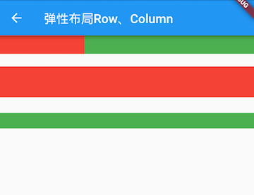

# 4.3 Flexible layout (Flex)

Flexible layout allows child components to allocate parent container space in a certain proportion. The concept of flexible layout also exists in other UI systems, such as flexible box layout in H5, and Android `FlexboxLayout`. Flutter primarily by the elastic layout `Flex`and `Expanded`to fit achieved.

### Flex

`Flex`The components can be arranged in the horizontal or vertical direction. If you know the main axis direction, it `Row`may `Column`be more convenient to use, because `Row`and `Column`are inherited from `Flex`, and the parameters are basically the same, so you can basically use `Row`or wherever Flex can be used `Column`. `Flex`The function itself is very powerful, and it can also `Expanded`cooperate with components to achieve flexible layout. Next, we only discuss `Flex`the attributes related to flexible layout (other attributes have been introduced in the introduction `Row`and `Column`time).

``` dart 
Flex({
 ...
 @required this.direction, //弹性布局的方向, Row默认为水平方向，Column默认为垂直方向
 List<Widget> children = const <Widget>[],
})

```

`Flex`Inherited from `MultiChildRenderObjectWidget`the corresponding `RenderObject`is `RenderFlex`, `RenderFlex`to achieve its layout algorithm.

### Expanded

It can be scaled "expanding stretch" `Row`, `Column`and `Flex`the space occupied by the subassembly.

``` dart 
const Expanded({
 int flex = 1, 
 @required Widget child,
})

```

`flex`The parameter is the coefficient of elasticity. If it is 0 or `null`, there `child`is no elasticity, that is, the space that will not be occupied by the expansion. If it is greater than 0, all the `Expanded`free space of the spindle is divided according to its flex ratio. Let's look at an example:

``` dart 
class FlexLayoutTestRoute extends StatelessWidget {
 @override
 Widget build(BuildContext context) {
   return Column(
     children: <Widget>[
       //Flex的两个子widget按1：2来占据水平空间  
       Flex(
         direction: Axis.horizontal,
         children: <Widget>[
           Expanded(
             flex: 1,
             child: Container(
               height: 30.0,
               color: Colors.red,
             ),
           ),
           Expanded(
             flex: 2,
             child: Container(
               height: 30.0,
               color: Colors.green,
             ),
           ),
         ],
       ),
       Padding(
         padding: const EdgeInsets.only(top: 20.0),
         child: SizedBox(
           height: 100.0,
           //Flex的三个子widget，在垂直方向按2：1：1来占用100像素的空间  
           child: Flex(
             direction: Axis.vertical,
             children: <Widget>[
               Expanded(
                 flex: 2,
                 child: Container(
                   height: 30.0,
                   color: Colors.red,
                 ),
               ),
               Spacer(
                 flex: 1,
               ),
               Expanded(
                 flex: 1,
                 child: Container(
                   height: 30.0,
                   color: Colors.green,
                 ),
               ),
             ],
           ),
         ),
       ),
     ],
   );
 }
}

```

The running effect is shown in Figure 4-5:



`Spacer`The function in the example is to occupy a specified proportion of space. In fact, it is just `Expanded`a packaging class. `Spacer`The source code is as follows:

``` dart 
class Spacer extends StatelessWidget {
 const Spacer({Key key, this.flex = 1})
   : assert(flex != null),
     assert(flex > 0),
     super(key: key);

 final int flex;

 @override
 Widget build(BuildContext context) {
   return Expanded(
     flex: flex,
     child: const SizedBox.shrink(),
   );
 }
}

```

### summary

Elastic layout is relatively simple, the only caveat is that `Row`, `Column`as well as `Flex`relationships.