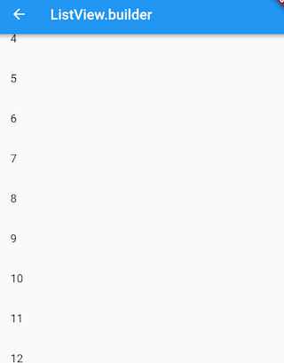
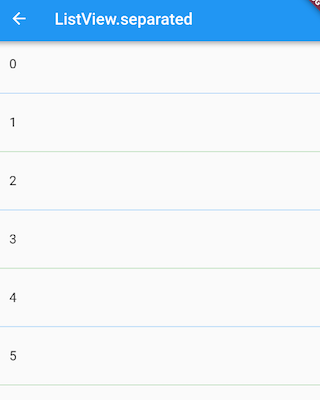
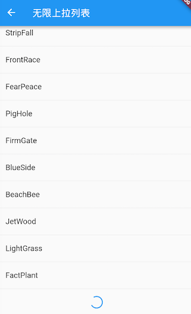
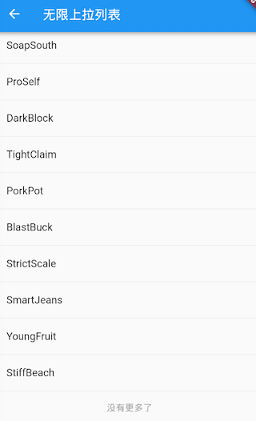
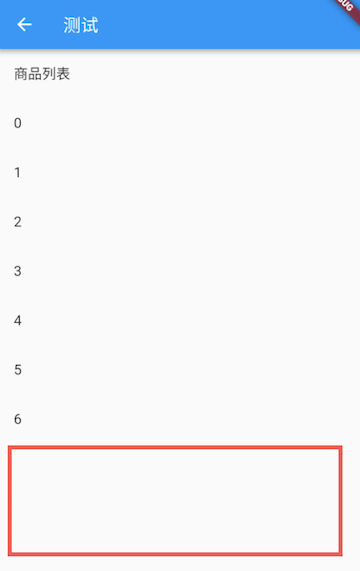
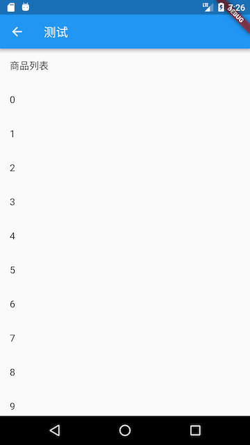

# 6.3 ListView

`ListView`It is one of the most commonly used scrollable components. It can arrange all subcomponents linearly in one direction, and it also supports the delayed construction model based on Sliver. Let's look at the default constructor definition of ListView:

``` dart 
ListView({
 ...  
 //可滚动widget公共参数
 Axis scrollDirection = Axis.vertical,
 bool reverse = false,
 ScrollController controller,
 bool primary,
 ScrollPhysics physics,
 EdgeInsetsGeometry padding,

 //ListView各个构造函数的共同参数  
 double itemExtent,
 bool shrinkWrap = false,
 bool addAutomaticKeepAlives = true,
 bool addRepaintBoundaries = true,
 double cacheExtent,

 //子widget列表
 List<Widget> children = const <Widget>[],
})

```

The above parameters are divided into two groups: the first group is the common parameters of the scrollable component, which have been introduced in the first section of this chapter, and will not be repeated; the second group is the common parameters of `ListView`each constructor ( `ListView`there are multiple constructors), we Focus on these parameters:

-   `itemExtent`: If this parameter is not set `null`, the mandatory `children`"length" is `itemExtent`the value; here "length" refers to the length of the sub-component in the scrolling direction, that is, if the scrolling direction is vertical, it `itemExtent`represents the height of the sub-component; If the scroll direction is horizontal, it `itemExtent`represents the width of the child component. In `ListView`, specifying `itemExtent`is more efficient than letting the sub-component determine its own length. This is because `itemExtent`after specifying , the scrolling system can know the length of the list in advance, without having to calculate it every time the sub-component is constructed, especially in the scroll position Frequent changes (the scrolling system needs to frequently calculate the height of the list).
-   `shrinkWrap`: This attribute indicates whether the length is set according to the total length of the sub-component `ListView`, the default value is `false`. By default, `ListView`will take up as much space as possible in the scroll direction. Must be when `ListView`in a container with no borders (in the scroll direction) .`shrinkWrap``true`
-   `addAutomaticKeepAlives`: This attribute indicates whether to wrap the list item (subcomponent) in the `AutomaticKeepAlive`component; typically, in a lazy loading list, if the list item is wrapped in `AutomaticKeepAlive`, it will not be GC when the list item slides out of the viewport (Garbage collection), it will be used `KeepAliveNotification`to save its state. If the list item itself maintains its `KeepAlive`state, then this parameter must be set to `false`.
-   `addRepaintBoundaries`: This attribute indicates whether to wrap the list item (subcomponent) in the `RepaintBoundary`component. When the scrollable component is scrolled, wrapping the list item in `RepaintBoundary`it can avoid redrawing the list item, but when the cost of redrawing the list item is very small (such as a color block, or a short text), `RepaintBoundary`it will be more if not added Efficient. And `addAutomaticKeepAlive`, as if to maintain its own list item `KeepAlive`state, this parameter must be set `false`.

> Note: The above parameters are not `ListView`unique, and other scrollable components introduced later in this chapter may also have these parameters, and their meanings are the same.

### Default constructor

The default constructor has one `children`parameter, which accepts a Widget list (List). This method is suitable for the case of only a small number of sub-components, because this method requires all `children`to be created in advance (this requires a lot of work), instead of waiting until the sub-widget is actually displayed, that is, through the default constructor The built ListView does not apply the Sliver-based lazy loading model. In fact , there is no essential difference between the method created in this way `ListView`and the method using `SingleChildScrollView`+ `Column`. Below is an example:

``` dart 
ListView(
 shrinkWrap: true, 
 padding: const EdgeInsets.all(20.0),
 children: <Widget>[
   const Text('I\'m dedicating every day to you'),
   const Text('Domestic life was never quite my style'),
   const Text('When you smile, you knock me out, I fall apart'),
   const Text('And I thought I was so smart'),
 ],
);

```

> Again, the scrollable component passes through a ListWhen used as its children attribute, it is only applicable to the situation with fewer subcomponents. This is a general rule, not `ListView`its own characteristic, and the same `GridView`is true for images .

### ListView.builder

`ListView.builder`It is suitable for situations where there are many (or unlimited) list items, because the sub-components will only be created when they are actually displayed, that is to say, what is created through this constructor `ListView`supports the lazy loading model based on Sliver. Let's look at `ListView.builder`the list of core parameters:

``` dart 
ListView.builder({
 // ListView公共参数已省略  
 ...
 @required IndexedWidgetBuilder itemBuilder,
 int itemCount,
 ...
})

```

-   `itemBuilder`: It is a builder of list items, the type is `IndexedWidgetBuilder`, and the return value is a widget. When the list scrolls to a specific `index`location, the builder will be called to build the list item.
-   `itemCount`: The number of list items. If it is `null`, it is an unlimited list.

> If the constructor of a scrollable component requires a list item Builder, the scrollable component built by the constructor usually supports the lazy loading model based on Sliver, and vice versa. This is a general rule. When we introduce the constructor of the scrollable component later, we will no longer specifically explain whether it supports the lazy loading model based on Sliver.

Let's look at an example:

``` dart 
ListView.builder(
   itemCount: 100,
   itemExtent: 50.0, //强制高度为50.0
   itemBuilder: (BuildContext context, int index) {
     return ListTile(title: Text("$index"));
   }
);

```

The running effect is shown in Figure 6-2:



### ListView.separated

`ListView.separated`You can add a split component between the generated list items, which `ListView.builder`has one more `separatorBuilder`parameter than a split component generator.

Let's look at an example: add a blue underline to odd rows, and add a green underline to even rows.

``` dart 
class ListView3 extends StatelessWidget {
 @override
 Widget build(BuildContext context) {
   //下划线widget预定义以供复用。  
   Widget divider1=Divider(color: Colors.blue,);
   Widget divider2=Divider(color: Colors.green);
   return ListView.separated(
       itemCount: 100,
       //列表项构造器
       itemBuilder: (BuildContext context, int index) {
         return ListTile(title: Text("$index"));
       },
       //分割器构造器
       separatorBuilder: (BuildContext context, int index) {
         return index%2==0?divider1:divider2;
       },
   );
 }
}

```



### Example: unlimited loading list

Suppose we want to pull some data asynchronously from the data source in batches, and then use the `ListView`display. When we slide to the end of the list, we judge whether we need to pull the data again. If it is, we will pull it. The pull process is at the end of the table. Display a loading, and insert the data into the list after the pull is successful; if you don't need to pull again, it will prompt "no more" at the end of the table. code show as below:

``` dart 
class InfiniteListView extends StatefulWidget {
 @override
 _InfiniteListViewState createState() => new _InfiniteListViewState();
}

class _InfiniteListViewState extends State<InfiniteListView> {
 static const loadingTag = "##loading##"; //表尾标记
 var _words = <String>[loadingTag];

 @override
 void initState() {
   super.initState();
   _retrieveData();
 }

 @override
 Widget build(BuildContext context) {
   return ListView.separated(
     itemCount: _words.length,
     itemBuilder: (context, index) {
       //如果到了表尾
       if (_words[index] == loadingTag) {
         //不足100条，继续获取数据
         if (_words.length - 1 < 100) {
           //获取数据
           _retrieveData();
           //加载时显示loading
           return Container(
             padding: const EdgeInsets.all(16.0),
             alignment: Alignment.center,
             child: SizedBox(
                 width: 24.0,
                 height: 24.0,
                 child: CircularProgressIndicator(strokeWidth: 2.0)
             ),
           );
         } else {
           //已经加载了100条数据，不再获取数据。
           return Container(
               alignment: Alignment.center,
               padding: EdgeInsets.all(16.0),
               child: Text("没有更多了", style: TextStyle(color: Colors.grey),)
           );
         }
       }
       //显示单词列表项
       return ListTile(title: Text(_words[index]));
     },
     separatorBuilder: (context, index) => Divider(height: .0),
   );
 }

 void _retrieveData() {
   Future.delayed(Duration(seconds: 2)).then((e) {
     setState(() {
       //重新构建列表
       _words.insertAll(_words.length - 1,
         //每次生成20个单词
         generateWordPairs().take(20).map((e) => e.asPascalCase).toList()
         );
     });
   });
 }

}

```

The effect after running is shown in Figure 6-4 and 6-5:



The code is relatively simple, readers can refer to the comments in the code to understand, so I won't repeat it. It should be noted that `_retrieveData()`the function is to simulate obtaining data asynchronously from the data source. We use the `generateWordPairs()`method of the english_words package to generate 20 words each time.

### Add a fixed header

Many times we need to add a fixed header to the list. For example, if we want to implement a product list, we need to add a "product list" title at the top of the list. The desired effect is shown in Figure 6-6:


Based on previous experience, we wrote the following code:

``` dart 
@override
Widget build(BuildContext context) {
 return Column(children: <Widget>[
   ListTile(title:Text("商品列表")),
   ListView.builder(itemBuilder: (BuildContext context, int index) {
       return ListTile(title: Text("$index"));
   }),
 ]);
}

```

Then run, and found that the desired effect did not appear, but triggered an exception;

``` dart 
Error caught by rendering library, thrown during performResize()。
Vertical viewport was given unbounded height ...

```

From the exception information, we can see that it is `ListView`caused by the uncertainty of the height boundary, so the solution is also obvious. We need to `ListView`specify the boundary. We `SizedBox`specify a list height to see if it works:

``` dart 
... //省略无关代码
SizedBox(
   height: 400, //指定列表高度为400
   child: ListView.builder(itemBuilder: (BuildContext context, int index) {
       return ListTile(title: Text("$index"));
   }),
),
...

```

The running effect is shown in Figure 6-7:



As you can see, no exception is triggered and the list has been displayed, but the height of our mobile phone screen is greater than 400, so there will be some blank space at the bottom. So what if we want to make the list fill up the screen space except the header? The intuitive method is that we dynamically calculate the remaining screen height by subtracting the height of the status bar, navigation bar, and header from the screen height. The code is as follows:

``` dart 
... //省略无关代码
SizedBox(
 //Material设计规范中状态栏、导航栏、ListTile高度分别为24、56、56 
 height: MediaQuery.of(context).size.height-24-56-56,
 child: ListView.builder(itemBuilder: (BuildContext context, int index) {
   return ListTile(title: Text("$index"));
 }),
)
...

```

The running effect is shown in Figure 6-8:



As you can see, the desired effect is achieved, but this method is not elegant. If the page layout changes, for example, the height of the header changes due to the adjustment of the header layout, the height of the remaining space must be recalculated. So is there any way to automatically stretch `ListView`to fill the remaining space on the screen? Of course there is! The answer is `Flex`. As mentioned earlier, in the flexible layout, you can use the `Expanded`automatic stretch component size, and we also said that it `Column`is inherited from `Flex`, so we can directly use `Column`+ `Expanded`to achieve, the code is as follows:

``` dart 
@override
Widget build(BuildContext context) {
 return Column(children: <Widget>[
   ListTile(title:Text("商品列表")),
   Expanded(
     child: ListView.builder(itemBuilder: (BuildContext context, int index) {
       return ListTile(title: Text("$index"));
     }),
   ),
 ]);
}

```

After running, it is the same as the picture above, it is perfectly realized!

### to sum up

This section mainly introduces `ListView`some public parameters and commonly used constructors. Different constructors correspond to different list item generation models. If you need to customize the list item generation model, you can `ListView.custom`customize it. It needs to implement a `SliverChildDelegate`component to generate list items for ListView. For more details, please refer to the API documentation.