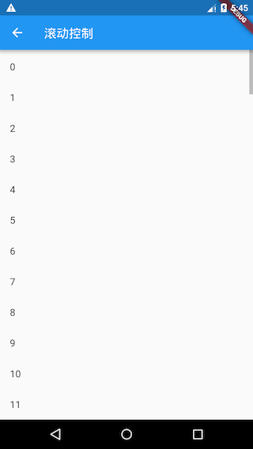
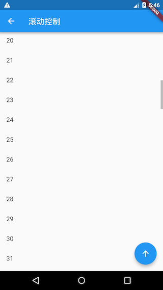
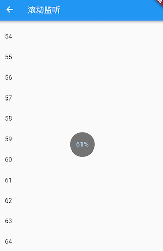

# 6.6 Scroll monitoring and control

In the previous sections, we introduced Flutter commonly used in scrollable component, also said that can be used `ScrollController`to control components can scroll scroll position, first introduce this section `ScrollController`, then `ListView`, for example, show how `ScrollController`the specific usage. Finally, I will introduce how to save the scroll position when the route is switched.

## 6.6.1 ScrollController

`ScrollController`The constructor is as follows:

``` dart 
ScrollController({
 double initialScrollOffset = 0.0, //初始滚动位置
 this.keepScrollOffset = true,//是否保存滚动位置
 ...
})

```

We introduce the `ScrollController`commonly used properties and methods:

-   `offset`: The current scroll position of the scrollable component.
-   `jumpTo(double offset)`, `animateTo(double offset,...)`: These two methods are used to jump to the specified position. The difference between them is that the latter will execute an animation when jumping, while the former will not.

`ScrollController`There are also some properties and methods, which we will explain later in the principle part.

#### Scroll monitor

`ScrollController`Indirectly inherited from `Listenable`, we can `ScrollController`monitor scroll events based on, such as:

``` dart 
controller.addListener(()=>print(controller.offset))

```

### Example

We create one `ListView`, when the scroll position changes, we first print out the current scroll position, and then determine whether the current position exceeds 1000 pixels, if it exceeds, a "back to top" button will be displayed in the lower right corner of the screen. This button can be clicked The ListView returns to its original position; if it does not exceed 1000 pixels, the "back to top" button is hidden. code show as below:

``` dart 

class ScrollControllerTestRoute extends StatefulWidget {
 @override
 ScrollControllerTestRouteState createState() {
   return new ScrollControllerTestRouteState();
 }
}

class ScrollControllerTestRouteState extends State<ScrollControllerTestRoute> {
 ScrollController _controller = new ScrollController();
 bool showToTopBtn = false; //是否显示“返回到顶部”按钮

 @override
 void initState() {
   super.initState();
   //监听滚动事件，打印滚动位置
   _controller.addListener(() {
     print(_controller.offset); //打印滚动位置
     if (_controller.offset < 1000 && showToTopBtn) {
       setState(() {
         showToTopBtn = false;
       });
     } else if (_controller.offset >= 1000 && showToTopBtn == false) {
       setState(() {
         showToTopBtn = true;
       });
     }
   });
 }

 @override
 void dispose() {
   //为了避免内存泄露，需要调用_controller.dispose
   _controller.dispose();
   super.dispose();
 }

 @override
 Widget build(BuildContext context) {
   return Scaffold(
     appBar: AppBar(title: Text("滚动控制")),
     body: Scrollbar(
       child: ListView.builder(
           itemCount: 100,
           itemExtent: 50.0, //列表项高度固定时，显式指定高度是一个好习惯(性能消耗小)
           controller: _controller,
           itemBuilder: (context, index) {
             return ListTile(title: Text("$index"),);
           }
       ),
     ),
     floatingActionButton: !showToTopBtn ? null : FloatingActionButton(
         child: Icon(Icons.arrow_upward),
         onPressed: () {
           //返回到顶部时执行动画
           _controller.animateTo(.0,
               duration: Duration(milliseconds: 200),
               curve: Curves.ease
           );
         }
     ),
   );
 }
}

```

The code description has been included in the comments, let's take a look at the running effect:



Since the height of the list item is 50 pixels, when sliding to the 20th list item, the "back to top" button will be displayed in the lower right corner. Click this button, and the ListView will perform a scrolling animation during the process of returning to the top. The animation time is 200 milliseconds , Animation curve is `Curves.ease`, we will introduce the details of animation in the chapter "Animation" later.

### Scroll position recovery

`PageStorage`It is a component used to save page (routing) related data. It does not affect the UI appearance of the subtree. In fact, it `PageStorage`is a functional component. It has a bucket. Widgets in the subtree can be specified by Different `PageStorageKey`to store their own data or status.

Every time rolling over, scrollable component will scroll position `offset`stored `PageStorage`when scrollable component and then re-create the recovery. If `ScrollController.keepScrollOffset`is `false`, then scroll position will not be stored, it will be used to re-create scrollable component `ScrollController.initialScrollOffset`; `ScrollController.keepScrollOffset`for the `true`time, scrollable component **for the first time** when you create, it will scroll to the `initialScrollOffset`place, because then scroll position has not been stored. In the next scroll, the scroll position will be stored and restored, and `initialScrollOffset`will be ignored.

When a route contains multiple scrollable components, if you find that the scroll position cannot be restored correctly after some jump or switching operations, then you can `PageStorageKey`track the positions of different scrollable components separately by explicitly specifying it. Such as:

``` dart 
ListView(key: PageStorageKey(1), ... );
...
ListView(key: PageStorageKey(2), ... );

```

Different `PageStorageKey`, different values ​​are required so that the scroll position can be saved for different scrollable components.

> Note: When a route contains multiple scrollable components, if you want to track their scroll positions separately, you don't have to provide them separately `PageStorageKey`. This is because Scrollable itself is a StatefulWidget, and its state will also save the current scroll position, so as long as the scrollable component itself is not detached from the tree, its State will not be destroyed (dispose), and the scroll position will not Will be lost. Only when the Widget structural changes occur, resulting in the loss of state will be destroyed when the State or rebuild scrollable component, this situation needs to be explicitly specified `PageStorageKey`, by `PageStorage`storing scroll position, a typical scenario is in use `TabBarView`, the place in Tab When switching, the State of the scrollable component in the Tab page will be destroyed. If you want to restore the scroll position, you need to specify it `PageStorageKey`.

### ScrollPosition

ScrollPosition is used to save the scroll position of the scrollable component. An `ScrollController`object can be used by multiple scrollable components at the same time, and an object `ScrollController`will be created for each scrollable component `ScrollPosition`. These are `ScrollPosition`stored in `ScrollController`the `positions`properties ( ). It is the object that actually saves the sliding position information, just a convenient attribute:`List<ScrollPosition>``ScrollPosition``offset`

``` dart 
double get offset => position.pixels;

```

A `ScrollController`While the components may correspond to a plurality of rolling, but there are some operations, such as reading scroll position `offset`, one is required! But we can still read the scroll position through other methods in one-to-many situations. For example, if one `ScrollController`is used by two scrollable components at the same time, then we can read their scroll positions separately by the following methods:

``` dart 
...
controller.positions.elementAt(0).pixels
controller.positions.elementAt(1).pixels
...

```

We can `controller.positions.length`determine the `controller`use of several scrollable components.

#### ScrollPosition method

`ScrollPosition`There are two commonly used methods: `animateTo()`and `jumpTo()`, they are really methods to control the scroll position of the jump `ScrollController`. These two methods with the same name will eventually be called internally `ScrollPosition`.

### ScrollController control principle

Let's introduce `ScrollController`three other methods:

``` dart 
ScrollPosition createScrollPosition(
   ScrollPhysics physics,
   ScrollContext context,
   ScrollPosition oldPosition);
void attach(ScrollPosition position) ;
void detach(ScrollPosition position) ;

```

When it `ScrollController`is associated with a scrollable component, the scrollable component will first call `ScrollController`a `createScrollPosition()`method to create one `ScrollPosition`to store the scroll position information, and then the scrollable component will call a `attach()`method to add the created attribute `ScrollPosition`to `ScrollController`the `positions`attribute. This step is called "registering position" "only registered `animateTo()`and `jumpTo()`can be called.

When scrollable component destroyed, calls `ScrollController`the `detach()`method, its `ScrollPosition`object from `ScrollController`the `positions`properties removed, this step is called "write-off position", write-offs `animateTo()`and `jumpTo()`will no longer be called.

Note that, `ScrollController`in `animateTo()`and `jumpTo()`internal calls all `ScrollPosition`the `animateTo()`and `jumpTo()`to achieve all this and `ScrollController`associated components are scrollable scroll to the specified location.

## 6.6.2 Scroll monitor

The child Widget in the Flutter Widget tree can communicate with the parent (including ancestor) Widget by sending a notification (Notification). The parent component can `NotificationListener`listen to the notifications it pays attention to through the component. This communication method is similar to the event bubbling of the browser in web development. We use the term "bubbling" in Flutter. We will talk about notification bubbling later. Details are introduced in the chapter "Event Handling and Notification".

Scrollable components will send `ScrollNotification`type notifications when scrolling , which `ScrollBar`is achieved by listening to scroll notifications. By `NotificationListener`listening to scroll through the event and `ScrollController`there are two main differences:

1.  Through NotificationListener, you can listen anywhere from the scrollable component to the root of the widget tree. It `ScrollController`can only be associated with specific scrollable components.
2.  The information obtained `NotificationListener`after receiving the scroll event is different; when the scroll event is received, the notification will carry some information about the current scroll position and ViewPort, but `ScrollController`only the current scroll position can be obtained.

### Example

Below, we monitor `ListView`the scroll notification, and then display the current scroll progress percentage:

``` dart 
import 'package:flutter/material.dart';

class ScrollNotificationTestRoute extends StatefulWidget {
 @override
 _ScrollNotificationTestRouteState createState() =>
     new _ScrollNotificationTestRouteState();
}

class _ScrollNotificationTestRouteState
   extends State<ScrollNotificationTestRoute> {
 String _progress = "0%"; //保存进度百分比

 @override
 Widget build(BuildContext context) {
   return Scrollbar( //进度条
     // 监听滚动通知
     child: NotificationListener<ScrollNotification>(
       onNotification: (ScrollNotification notification) {
         double progress = notification.metrics.pixels /
             notification.metrics.maxScrollExtent;
         //重新构建
         setState(() {
           _progress = "${(progress * 100).toInt()}%";
         });
         print("BottomEdge: ${notification.metrics.extentAfter == 0}");
         //return true; //放开此行注释后，进度条将失效
       },
       child: Stack(
         alignment: Alignment.center,
         children: <Widget>[
           ListView.builder(
               itemCount: 100,
               itemExtent: 50.0,
               itemBuilder: (context, index) {
                 return ListTile(title: Text("$index"));
               }
           ),
           CircleAvatar(  //显示进度百分比
             radius: 30.0,
             child: Text(_progress),
             backgroundColor: Colors.black54,
           )
         ],
       ),
     ),
   );
 }
}

```

The running result is shown in Figure 6-16:



When a scroll event is received, the parameter type is `ScrollNotification`, it includes an `metrics`attribute, and its type is `ScrollMetrics`, the attribute contains information such as the current ViewPort and scroll position:

-   `pixels`: Current scroll position.
-   `maxScrollExtent`: Maximum scrollable length.
-   `extentBefore`: Slide out the length of the top of the ViewPort; in this example, it is equivalent to the length of the list at the top of the screen when the top slides out.
-   `extentInside`: ViewPort internal length; the length of the list part displayed on the screen in this example.
-   `extentAfter`: The length of the ViewPort part that is not slid into the list; in this example, the length of the screen range part is not displayed at the bottom of the list.
-   `atEdge`：Whether it slides to the boundary of the scrollable component (in this example, it is equivalent to the top or bottom of the list).

ScrollMetrics has some other properties, readers can consult the API documentation by themselves.