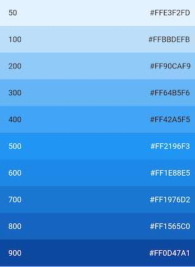
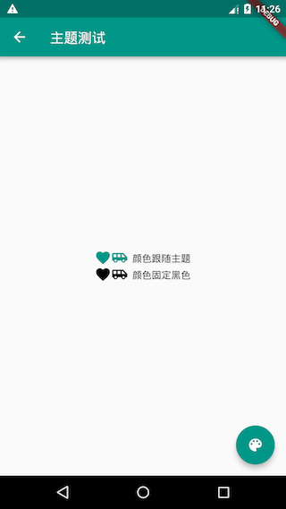
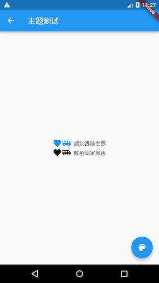

# 7.4 Colors and themes

## 7.4.1 Color

Before introducing the theme, let's get to know some Color classes in Flutter. The color in the Color class is saved as an int value. We know that the monitor color is composed of three primary colors of red, green, and blue. Each color occupies 8 bits. The storage structure is as follows:

| Bit   | Color          |
| ----- | -------------- |
| 0-7   | blue           |
| 8-15  | green          |
| 16-23 | red            |
| 24-31 | Alpha(Opacity) |


The fields in the above table have corresponding properties in the Color class, and many methods in Color manipulate these properties. Since most of them are relatively simple, readers can check the class definition to understand. Here we mainly discuss two points: color value conversion and brightness.

### **How to convert a color string into a Color object**

For example, the color value in Web development is usually a string such as "#dc380d", which is an RGB value. We can convert it to the Color class by the following methods:

``` dart 
Color(0xffdc380d); //如果颜色固定可以直接使用整数值
//颜色是一个字符串变量
var c = "dc380d";
Color(int.parse(c,radix:16)|0xFF000000) //通过位运算符将Alpha设置为FF
Color(int.parse(c,radix:16)).withAlpha(255)  //通过方法将Alpha设置为FF

```

### Color brightness

Suppose, we want to implement a navigation bar with a customizable background color and Title, and when the background color is dark, we should display the Title as a light color; when the background color is a light color, the Title is displayed as a dark color. To achieve this function, we need to calculate the brightness of the background color, and then dynamically determine the color of the Title. The Color class provides a `computeLuminance()`method that can return a value of [0-1]. The larger the number, the lighter the color. We can dynamically determine the color of the Title based on it. The following is a simple implementation of NavBar in the navigation bar:

``` dart 
class NavBar extends StatelessWidget {
 final String title;
 final Color color; //背景颜色

 NavBar({
   Key key,
   this.color,
   this.title,
 });

 @override
 Widget build(BuildContext context) {
   return Container(
     constraints: BoxConstraints(
       minHeight: 52,
       minWidth: double.infinity,
     ),
     decoration: BoxDecoration(
       color: color,
       boxShadow: [
         //阴影
         BoxShadow(
           color: Colors.black26,
           offset: Offset(0, 3),
           blurRadius: 3,
         ),
       ],
     ),
     child: Text(
       title,
       style: TextStyle(
         fontWeight: FontWeight.bold,
         //根据背景色亮度来确定Title颜色
         color: color.computeLuminance() < 0.5 ? Colors.white : Colors.black,
       ),
     ),
     alignment: Alignment.center,
   );
 }
}

```

The test code is as follows:

``` dart 
Column(
 children: <Widget>[
   //背景为蓝色，则title自动为白色
   NavBar(color: Colors.blue, title: "标题"), 
   //背景为白色，则title自动为黑色
   NavBar(color: Colors.white, title: "标题"),
 ]
)

```

The running effect is shown in Figure 7-4:


### Material Color

`MaterialColor`It is a class that implements the color in Material Design. It contains 10 levels of gradients of one color. `MaterialColor`The index value of the "[]" operator is used to represent the depth of the color. The valid indexes are: 50, 100, 200,..., 900. The larger the number, the darker the color. `MaterialColor`The default value is the color with index equal to 500. For example, it `Colors.blue`is a predefined `MaterialColor`class object defined as follows:

``` dart 
static const MaterialColor blue = MaterialColor(
 _bluePrimaryValue,
 <int, Color>{
    50: Color(0xFFE3F2FD),
   100: Color(0xFFBBDEFB),
   200: Color(0xFF90CAF9),
   300: Color(0xFF64B5F6),
   400: Color(0xFF42A5F5),
   500: Color(_bluePrimaryValue),
   600: Color(0xFF1E88E5),
   700: Color(0xFF1976D2),
   800: Color(0xFF1565C0),
   900: Color(0xFF0D47A1),
 },
);
static const int _bluePrimaryValue = 0xFF2196F3;

```

`Colors.blue[50]`The `Colors.blue[900]`color value gradient from light blue to dark blue, the effect shown in Figure 7-5:



## 7.4.2 Theme

`Theme`Component can define theme data (ThemeData) for Material APP. Many components in the Material component library use theme data, such as navigation bar color, title font, Icon style, etc. `Theme`Inner users are used `InheritedWidget`to share style data for their subtrees.

### ThemeData

`ThemeData`It is used to save the theme data of the Material component library. Material components need to comply with the corresponding design specifications, and the customizable parts of these specifications are defined in ThemeData, so we can customize the application theme through ThemeData. In sub-components, we can `Theme.of`get the current through methods `ThemeData`.

> Note: Some of the Material Design specifications cannot be customized, such as the height of the navigation bar. ThemeData only includes the customizable part.

We look at `ThemeData`some data definitions:

``` dart 
ThemeData({
 Brightness brightness, //深色还是浅色
 MaterialColor primarySwatch, //主题颜色样本，见下面介绍
 Color primaryColor, //主色，决定导航栏颜色
 Color accentColor, //次级色，决定大多数Widget的颜色，如进度条、开关等。
 Color cardColor, //卡片颜色
 Color dividerColor, //分割线颜色
 ButtonThemeData buttonTheme, //按钮主题
 Color cursorColor, //输入框光标颜色
 Color dialogBackgroundColor,//对话框背景颜色
 String fontFamily, //文字字体
 TextTheme textTheme,// 字体主题，包括标题、body等文字样式
 IconThemeData iconTheme, // Icon的默认样式
 TargetPlatform platform, //指定平台，应用特定平台控件风格
 ...
})

```

The above is just `ThemeData`a small part of the attributes. Readers of the complete data definition can check the SDK. The above properties should be noted that `primarySwatch`it is a color theme "sample color", may generate some other properties under certain conditions by the color sample, e.g., if not specified `primaryColor`, and the dark current theme is not the theme, then `primaryColor`it will default to `primarySwatch`the specified color, there are some similar attributes such as `accentColor`, `indicatorColor`and so will be affected by `primarySwatch`the impact.

### Example

We implement a routing skinning function:

``` dart 

class ThemeTestRoute extends StatefulWidget {
 @override
 _ThemeTestRouteState createState() => new _ThemeTestRouteState();
}

class _ThemeTestRouteState extends State<ThemeTestRoute> {
 Color _themeColor = Colors.teal; //当前路由主题色

 @override
 Widget build(BuildContext context) {
   ThemeData themeData = Theme.of(context);
   return Theme(
     data: ThemeData(
         primarySwatch: _themeColor, //用于导航栏、FloatingActionButton的背景色等
         iconTheme: IconThemeData(color: _themeColor) //用于Icon颜色
     ),
     child: Scaffold(
       appBar: AppBar(title: Text("主题测试")),
       body: Column(
         mainAxisAlignment: MainAxisAlignment.center,
         children: <Widget>[
           //第一行Icon使用主题中的iconTheme
           Row(
               mainAxisAlignment: MainAxisAlignment.center,
               children: <Widget>[
                 Icon(Icons.favorite),
                 Icon(Icons.airport_shuttle),
                 Text("  颜色跟随主题")
               ]
           ),
           //为第二行Icon自定义颜色（固定为黑色)
           Theme(
             data: themeData.copyWith(
               iconTheme: themeData.iconTheme.copyWith(
                   color: Colors.black
               ),
             ),
             child: Row(
                 mainAxisAlignment: MainAxisAlignment.center,
                 children: <Widget>[
                   Icon(Icons.favorite),
                   Icon(Icons.airport_shuttle),
                   Text("  颜色固定黑色")
                 ]
             ),
           ),
         ],
       ),
       floatingActionButton: FloatingActionButton(
           onPressed: () =>  //切换主题
               setState(() =>
               _themeColor =
               _themeColor == Colors.teal ? Colors.blue : Colors.teal
               ),
           child: Icon(Icons.palette)
       ),
     ),
   );
 }
}

```

After running, click the floating button in the lower right corner to switch the theme, as shown in Figure 7-6 and 7-7:



There are three points to note:

-   The global theme can be overridden by the local theme, just like the fixed color (black) is specified for the second line of icons through Theme in the code, this is a common technique, and this method is often used in Flutter to customize the subtree theme. So why can a local theme override a global theme? This is mainly because when the theme style is used in the widget, it is obtained through `Theme.of(BuildContext context)`it. Let's take a look at its simplified code:
   
``` dart 
   static ThemeData of(BuildContext context, { bool shadowThemeOnly = false }) {
      // 简化代码，并非源码  
      return context.dependOnInheritedWidgetOfExactType<_InheritedTheme>().theme.data
   }
   
```
   
   `context.dependOnInheritedWidgetOfExactType`It will look up the first type `_InheritedTheme`of widget from the current position in the widget tree . So when the local is specified `Theme`, `Theme.of()`the first one found by searching upward in the subtree is the one `_InheritedTheme`we specified `Theme`.
   
-   This example is to skin a single route. If you want to skin the entire application, you can modify `MaterialApp`the `theme`attributes.