# 7.6 Detailed Dialog

This section will introduce in detail the usage, implementation principle, style customization and status management of dialog boxes in Flutter.

## 7.6.1 Using dialog boxes

A dialog box is essentially a UI layout. Usually a dialog box contains a title, content, and some operation buttons. For this reason, some ready-made dialog components are provided in the Material library to quickly build a complete dialog box.

### AlertDialog

Below we mainly introduce the `AlertDialog`components in the Material library . Its constructor is defined as follows:

``` dart 
const AlertDialog({
 Key key,
 this.title, //对话框标题组件
 this.titlePadding, // 标题填充
 this.titleTextStyle, //标题文本样式
 this.content, // 对话框内容组件
 this.contentPadding = const EdgeInsets.fromLTRB(24.0, 20.0, 24.0, 24.0), //内容的填充
 this.contentTextStyle,// 内容文本样式
 this.actions, // 对话框操作按钮组
 this.backgroundColor, // 对话框背景色
 this.elevation,// 对话框的阴影
 this.semanticLabel, //对话框语义化标签(用于读屏软件)
 this.shape, // 对话框外形
})

```

The parameters are relatively simple, so I won't repeat them. Let's look at an example. If we want to pop up a confirmation dialog box when deleting a file, the dialog box is shown in Figure 7-10:

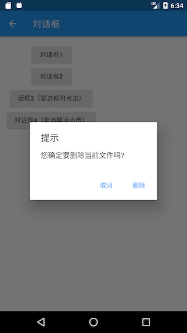

The dialog style code is as follows:

``` dart 
AlertDialog(
 title: Text("提示"),
 content: Text("您确定要删除当前文件吗?"),
 actions: <Widget>[
   FlatButton(
     child: Text("取消"),
     onPressed: () => Navigator.of(context).pop(), //关闭对话框
   ),
   FlatButton(
     child: Text("删除"),
     onPressed: () {
       // ... 执行删除操作
       Navigator.of(context).pop(true); //关闭对话框
     },
   ),
 ],
);

```

The implementation code is very simple, so I won't repeat it. The only thing to note is that we `Navigator.of(context).pop(…)`close the dialog box through a method, which is consistent with the way the route returns, and both can return a result data. Now that we have built the dialog box, how do we pop it up? And how should the data returned by the dialog be received? The answers to these questions are in the `showDialog()`method.

`showDialog()`It is a method provided by the Material component library for popping up a Material style dialog box. The signature is as follows:

``` dart 
Future<T> showDialog<T>({
 @required BuildContext context,
 bool barrierDismissible = true, //点击对话框barrier(遮罩)时是否关闭它
 WidgetBuilder builder, // 对话框UI的builder
})

```

This method has only two parameters, see notes for the meaning. This method returns one `Future`, which is used to receive the return value of the dialog box: if we close the dialog box by clicking the mask, `Future`the value is `null`, otherwise it is `Navigator.of(context).pop(result)`the result value returned by us. Let’s take a look at the entire example:

``` dart 
//点击该按钮后弹出对话框
RaisedButton(
 child: Text("对话框1"),
 onPressed: () async {
   //弹出对话框并等待其关闭
   bool delete = await showDeleteConfirmDialog1();
   if (delete == null) {
     print("取消删除");
   } else {
     print("已确认删除");
     //... 删除文件
   }
 },
),

// 弹出对话框
Future<bool> showDeleteConfirmDialog1() {
 return showDialog<bool>(
   context: context,
   builder: (context) {
     return AlertDialog(
       title: Text("提示"),
       content: Text("您确定要删除当前文件吗?"),
       actions: <Widget>[
         FlatButton(
           child: Text("取消"),
           onPressed: () => Navigator.of(context).pop(), // 关闭对话框
         ),
         FlatButton(
           child: Text("删除"),
           onPressed: () {
             //关闭对话框并返回true
             Navigator.of(context).pop(true);
           },
         ),
       ],
     );
   },
 );
}

```

After the example runs, we click the dialog box "Cancel" button or mask, the console will output "Cancel delete", if you click the "Delete" button, the console will output "Confirmed deletion".

> Note: If `AlertDialog`the content is too long, the content will overflow, which may not be what we expect in many cases, so if the content of the dialog box is too long, you can `SingleChildScrollView`wrap the content.

### SimpleDialog

`SimpleDialog`It is also a dialog box provided by the Material component library, which will display a list for the scene selected by the list. The following is an example of selecting APP language, and the running result is shown in Figure 7-11.

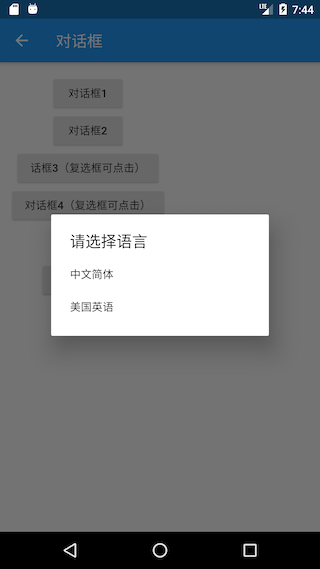

The implementation code is as follows:

``` dart 
Future<void> changeLanguage() async {
 int i = await showDialog<int>(
     context: context,
     builder: (BuildContext context) {
       return SimpleDialog(
         title: const Text('请选择语言'),
         children: <Widget>[
           SimpleDialogOption(
             onPressed: () {
               // 返回1
               Navigator.pop(context, 1);
             },
             child: Padding(
               padding: const EdgeInsets.symmetric(vertical: 6),
               child: const Text('中文简体'),
             ),
           ),
           SimpleDialogOption(
             onPressed: () {
               // 返回2
               Navigator.pop(context, 2);
             },
             child: Padding(
               padding: const EdgeInsets.symmetric(vertical: 6),
               child: const Text('美国英语'),
             ),
           ),
         ],
       );
     });

 if (i != null) {
   print("选择了：${i == 1 ? "中文简体" : "美国英语"}");
 }
}

```

We used a `SimpleDialogOption`component to wrap the list item component , which is equivalent to a FlatButton, except that the button text is left-aligned and the padding is small. After the above example runs, after the user selects a language, the console will print it out.

### Dialog

In fact `AlertDialog`, `SimpleDialog`both `Dialog`classes are used . Because `AlertDialog`and `SimpleDialog`are used `IntrinsicWidth`to try to adjust the size of their actual size of the sub assembly, which leads to their component sub-assembly is not loaded delay model (e.g. `ListView`, `GridView`, `CustomScrollView`etc.), as the following code after being given run.

``` dart 
AlertDialog(
 content: ListView(
   children: ...//省略
 ),
);

```

What if we just need to nest one `ListView`? At this time, we can directly use the `Dialog`class, such as:

``` dart 
Dialog(
 child: ListView(
   children: ...//省略
 ),
);

```

Let's look at an example of a pop-up dialog box with 30 list items. The running effect is shown in Figure 7-12:

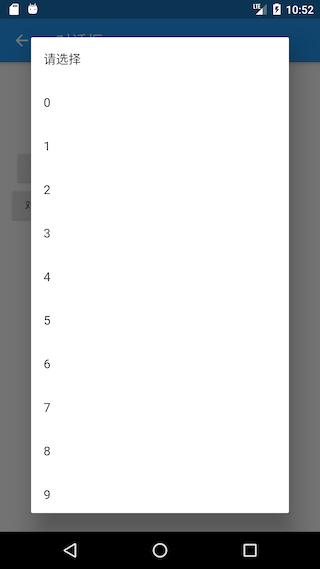

The implementation code is as follows:

``` dart 
Future<void> showListDialog() async {
 int index = await showDialog<int>(
   context: context,
   builder: (BuildContext context) {
     var child = Column(
       children: <Widget>[
         ListTile(title: Text("请选择")),
         Expanded(
             child: ListView.builder(
           itemCount: 30,
           itemBuilder: (BuildContext context, int index) {
             return ListTile(
               title: Text("$index"),
               onTap: () => Navigator.of(context).pop(index),
             );
           },
         )),
       ],
     );
     //使用AlertDialog会报错
     //return AlertDialog(content: child);
     return Dialog(child: child);
   },
 );
 if (index != null) {
   print("点击了：$index");
 }
}

```

Now, we have finished the introduction `AlertDialog`, `SimpleDialog`and `Dialog`. The example above, we call `showDialog`upon, in `builder`the building is a three components of the dialog box, there may be some readers will think that inertia in `builder`return can only be one of these three, in fact, this is not necessary! Take `Dialog`the example as an example, we can replace it with the following code `Dialog`:

``` dart 
// return Dialog(child: child) 
return UnconstrainedBox(
 constrainedAxis: Axis.vertical,
 child: ConstrainedBox(
   constraints: BoxConstraints(maxWidth: 280),
   child: Material(
     child: child,
     type: MaterialType.card,
   ),
 ),
);

```

The same effect can be achieved after the above code is run. Now we summarize: `AlertDialog`, `SimpleDialog`and `Dialog`is Material component library provides three dialog boxes, designed to help developers quickly build up a dialog in line with Material design specifications, but the reader can customize dialog style, therefore, we can still achieve Various styles of dialog boxes bring both ease of use and strong scalability.

## 7.6.2 Dialog opening animation and mask

We can divide the dialog box into two parts: internal style and external style. The internal style refers to the specific content displayed in the dialog box, which we have already introduced above; the external style includes the dialog box mask style, opening animation, etc. This section mainly introduces how to customize these external styles.

> We will introduce animation-related content in the later chapters of this book. Readers can first understand the following content (no need to go into it). Readers can look back after learning animation-related content.

We have already introduced the `showDialog`method, which is a method provided in the Material component library to open a Material style dialog box. How to open a common style dialog box (non-Material style)? Flutter provides a `showGeneralDialog`method with the following signature:

``` dart 
Future<T> showGeneralDialog<T>({
 @required BuildContext context,
 @required RoutePageBuilder pageBuilder, //构建对话框内部UI
 bool barrierDismissible, //点击遮罩是否关闭对话框
 String barrierLabel, // 语义化标签(用于读屏软件)
 Color barrierColor, // 遮罩颜色
 Duration transitionDuration, // 对话框打开/关闭的动画时长
 RouteTransitionsBuilder transitionBuilder, // 对话框打开/关闭的动画
})

```

In fact, the `showDialog`method is just `showGeneralDialog`an encapsulation, customizing the mask color and animation of the Material style dialog box. The material style dialog box opening/closing animation is a Fade (fading out) animation. If we want to use a zooming animation, we can `transitionBuilder`customize it. Below we encapsulate a `showCustomDialog`method by ourselves , its customized dialog box animation is zoom animation, and at the same time the mask color is specified as `Colors.black87`:

``` dart 
Future<T> showCustomDialog<T>({
 @required BuildContext context,
 bool barrierDismissible = true,
 WidgetBuilder builder,
}) {
 final ThemeData theme = Theme.of(context, shadowThemeOnly: true);
 return showGeneralDialog(
   context: context,
   pageBuilder: (BuildContext buildContext, Animation<double> animation,
       Animation<double> secondaryAnimation) {
     final Widget pageChild = Builder(builder: builder);
     return SafeArea(
       child: Builder(builder: (BuildContext context) {
         return theme != null
             ? Theme(data: theme, child: pageChild)
             : pageChild;
       }),
     );
   },
   barrierDismissible: barrierDismissible,
   barrierLabel: MaterialLocalizations.of(context).modalBarrierDismissLabel,
   barrierColor: Colors.black87, // 自定义遮罩颜色
   transitionDuration: const Duration(milliseconds: 150),
   transitionBuilder: _buildMaterialDialogTransitions,
 );
}

Widget _buildMaterialDialogTransitions(
   BuildContext context,
   Animation<double> animation,
   Animation<double> secondaryAnimation,
   Widget child) {
 // 使用缩放动画
 return ScaleTransition(
   scale: CurvedAnimation(
     parent: animation,
     curve: Curves.easeOut,
   ),
   child: child,
 );
}

```

Now, we use the `showCustomDialog`open file delete confirmation dialog box, the code is as follows:

``` dart 
... //省略无关代码
showCustomDialog<bool>(
 context: context,
 builder: (context) {
   return AlertDialog(
     title: Text("提示"),
     content: Text("您确定要删除当前文件吗?"),
     actions: <Widget>[
       FlatButton(
         child: Text("取消"),
         onPressed: () => Navigator.of(context).pop(),
       ),
       FlatButton(
         child: Text("删除"),
         onPressed: () {
           // 执行删除操作
           Navigator.of(context).pop(true);
         },
       ),
     ],
   );
 },
);

```

The running effect is shown in Figure 7-13:

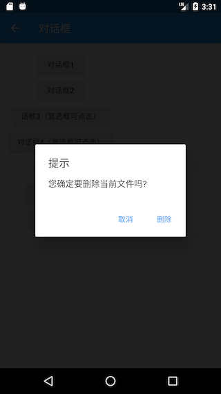

It can be found that the mask color is darker than `showDialog`the dialog box opened by the method. In addition, the dialog box opening/closing animation has become a zoom animation, and readers can run the example to check the effect.

## 7.6.3 Principle of dialog box realization

We already know that the dialog box is finally `showGeneralDialog`opened by a method, let's take a look at its specific implementation:

``` dart 
Future<T> showGeneralDialog<T>({
 @required BuildContext context,
 @required RoutePageBuilder pageBuilder,
 bool barrierDismissible,
 String barrierLabel,
 Color barrierColor,
 Duration transitionDuration,
 RouteTransitionsBuilder transitionBuilder,
}) {
 return Navigator.of(context, rootNavigator: true).push<T>(_DialogRoute<T>(
   pageBuilder: pageBuilder,
   barrierDismissible: barrierDismissible,
   barrierLabel: barrierLabel,
   barrierColor: barrierColor,
   transitionDuration: transitionDuration,
   transitionBuilder: transitionBuilder,
 ));
}

```

Achieve is very simple, direct call `Navigator`the `push`method to open a new dialog route `_DialogRoute`, and then return the `push`return value. The visible dialog box is actually implemented in the form of routing, which is why we can use `Navigator`the `pop`method to exit the dialog box. Regarding the style customization of the dialog box `_DialogRoute`, there is nothing new, and readers can check it by themselves.

## 7.6.4 Dialog state management

When the user chooses to delete a file, we will ask whether to delete the file; when the user chooses a folder, we should let the user confirm whether to delete the subfolder. In order to avoid the second pop-up window confirming whether to delete the subdirectories when the user selects a folder, we add a "Also delete subdirectories?" check box at the bottom of the confirmation dialog box, as shown in Figure 7-14:

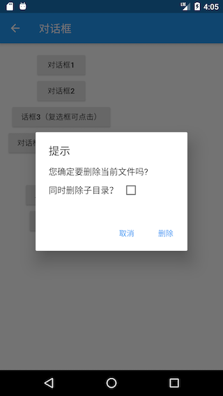

Now there is a question: how to manage the checked state of the check box? Traditionally, we will manage the selected state in the State of the routing page. We may write the following code:

``` dart 
class _DialogRouteState extends State<DialogRoute> {
 bool withTree = false; // 复选框选中状态

 @override
 Widget build(BuildContext context) {
   return Column(
     children: <Widget>[
       RaisedButton(
         child: Text("对话框2"),
         onPressed: () async {
           bool delete = await showDeleteConfirmDialog2();
           if (delete == null) {
             print("取消删除");
           } else {
             print("同时删除子目录: $delete");
           }
         },
       ),
     ],
   );
 }

 Future<bool> showDeleteConfirmDialog2() {
   withTree = false; // 默认复选框不选中
   return showDialog<bool>(
     context: context,
     builder: (context) {
       return AlertDialog(
         title: Text("提示"),
         content: Column(
           crossAxisAlignment: CrossAxisAlignment.start,
           mainAxisSize: MainAxisSize.min,
           children: <Widget>[
             Text("您确定要删除当前文件吗?"),
             Row(
               children: <Widget>[
                 Text("同时删除子目录？"),
                 Checkbox(
                   value: withTree,
                   onChanged: (bool value) {
                     //复选框选中状态发生变化时重新构建UI
                     setState(() {
                       //更新复选框状态
                       withTree = !withTree;
                     });
                   },
                 ),
               ],
             ),
           ],
         ),
         actions: <Widget>[
           FlatButton(
             child: Text("取消"),
             onPressed: () => Navigator.of(context).pop(),
           ),
           FlatButton(
             child: Text("删除"),
             onPressed: () {
               //执行删除操作
               Navigator.of(context).pop(withTree);
             },
           ),
         ],
       );
     },
   );
 }
}

```

Then, when we run the above code, we will find that the checkbox is not selected at all! Why is this so? In fact, the reason is very simple, we know that the `setState`method will only be rebuilt for the subtree of the current context, but our dialog is not built in `_DialogRouteState`the `build`method, but `showDialog`constructed separately, so `_DialogRouteState`calling in the context `setState`cannot affect the passage `showDialog`Build the UI. In addition, we can understand this phenomenon from another angle. As mentioned earlier, the dialog box is also realized by routing. The above code is actually equivalent to trying to call in the parent route `setState`to update the child route. This is obviously It won't work! In short, the root cause is that the context is wrong. How to make the checkbox clickable? There are usually three methods as follows:

### Separately extract StatefulWidget

Since the context is wrong, the straightforward idea is to encapsulate the check box selection logic into one separately `StatefulWidget`, and then manage the check state inside it. Let's take a look at this method first, the following is the implementation code:

``` dart 
// 单独封装一个内部管理选中状态的复选框组件
class DialogCheckbox extends StatefulWidget {
 DialogCheckbox({
   Key key,
   this.value,
   @required this.onChanged,
 });

 final ValueChanged<bool> onChanged;
 final bool value;

 @override
 _DialogCheckboxState createState() => _DialogCheckboxState();
}

class _DialogCheckboxState extends State<DialogCheckbox> {
 bool value;

 @override
 void initState() {
   value = widget.value;
   super.initState();
 }

 @override
 Widget build(BuildContext context) {
   return Checkbox(
     value: value,
     onChanged: (v) {
       //将选中状态通过事件的形式抛出
       widget.onChanged(v);
       setState(() {
         //更新自身选中状态
         value = v;
       });
     },
   );
 }
}

```

Here is the code for the pop-up dialog:

``` dart 
Future<bool> showDeleteConfirmDialog3() {
 bool _withTree = false; //记录复选框是否选中
 return showDialog<bool>(
   context: context,
   builder: (context) {
     return AlertDialog(
       title: Text("提示"),
       content: Column(
         crossAxisAlignment: CrossAxisAlignment.start,
         mainAxisSize: MainAxisSize.min,
         children: <Widget>[
           Text("您确定要删除当前文件吗?"),
           Row(
             children: <Widget>[
               Text("同时删除子目录？"),
               DialogCheckbox(
                 value: _withTree, //默认不选中
                 onChanged: (bool value) {
                   //更新选中状态
                   _withTree = !_withTree;
                 },
               ),
             ],
           ),
         ],
       ),
       actions: <Widget>[
         FlatButton(
           child: Text("取消"),
           onPressed: () => Navigator.of(context).pop(),
         ),
         FlatButton(
           child: Text("删除"),
           onPressed: () {
             // 将选中状态返回
             Navigator.of(context).pop(_withTree);
           },
         ),
       ],
     );
   },
 );
}

```

Finally, use:

``` dart 
RaisedButton(
 child: Text("话框3（复选框可点击）"),
 onPressed: () async {
   //弹出删除确认对话框，等待用户确认
   bool deleteTree = await showDeleteConfirmDialog3();
   if (deleteTree == null) {
     print("取消删除");
   } else {
     print("同时删除子目录: $deleteTree");
   }
 },
),

```

The effect after running is shown in Figure 7-15:

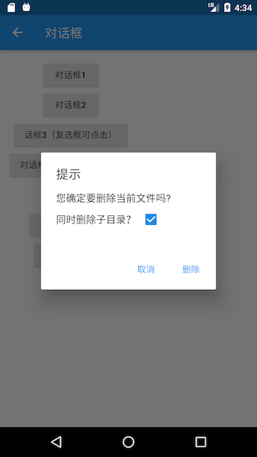

The visible checkbox can be selected. After clicking "Cancel" or "Delete", the console will print out the final confirmation status.

### Use StatefulBuilder method

Although the above method can solve the problem of dialog box status update, it has an obvious shortcoming-all components on the dialog box that may change status have to be individually encapsulated in a state that manages internally `StatefulWidget`. This is not only troublesome, but also complex. Not very useful. So, let's think about whether we can find a simpler way? The above method essentially puts the state of the dialog box in a `StatefulWidget`context, which is managed `StatefulWidget`internally, so is there a way to create a `StatefulWidget`context without separately extracting components ? Thinking of this, we can `Builder`get inspiration from the implementation of components. In the previous introduction, the `Builder`component can obtain the real Context where the component is located. How is it implemented? Let's take a look at its source code:

``` dart 
class Builder extends StatelessWidget {
 const Builder({
   Key key,
   @required this.builder,
 }) : assert(builder != null),
      super(key: key);
 final WidgetBuilder builder;

 @override
 Widget build(BuildContext context) => builder(context);
}

```

As you can see, `Builder`it is actually just inherited `StatelessWidget`, and then the `build`construction method is delegated to the `builder`callback after obtaining the current context in the method. It can be seen that the context `Builder`is actually obtained `StatelessWidget`. So can we use the same method to obtain `StatefulWidget`the context of and proxy its `build`methods? Let's take a picture of a cat and draw a tiger to encapsulate a `StatefulBuilder`method:

``` dart 
class StatefulBuilder extends StatefulWidget {
 const StatefulBuilder({
   Key key,
   @required this.builder,
 }) : assert(builder != null),
      super(key: key);

 final StatefulWidgetBuilder builder;

 @override
 _StatefulBuilderState createState() => _StatefulBuilderState();
}

class _StatefulBuilderState extends State<StatefulBuilder> {
 @override
 Widget build(BuildContext context) => widget.builder(context, setState);
}

```

The code is very simple, the context is `StatefulBuilder`obtained `StatefulWidget`and the construction process is proxied. Below we can `StatefulBuilder`refactor the above code (changes only in `DialogCheckbox`part):

``` dart 
... //省略无关代码
Row(
 children: <Widget>[
   Text("同时删除子目录？"),
   //使用StatefulBuilder来构建StatefulWidget上下文
   StatefulBuilder(
     builder: (context, _setState) {
       return Checkbox(
         value: _withTree, //默认不选中
         onChanged: (bool value) {
           //_setState方法实际就是该StatefulWidget的setState方法，
           //调用后builder方法会重新被调用
           _setState(() {
             //更新选中状态
             _withTree = !_withTree;
           });
         },
       );
     },
   ),
 ],
),

```

In fact, this method is essentially that the child component notifies the parent component (StatefulWidget) to rebuild the child component itself to implement UI updates. Readers can compare the code to understand. In fact, `StatefulBuilder`a class is the Flutter SDK provided, and its `Builder`principle is the same, in this, be sure to remind readers `StatefulBuilder`and `Builder`thorough understanding because they Flutter is very practical.

### Subtle solution

Is there a simpler solution? To confirm this problem, we must first figure out how the UI is updated. We know that it will rebuild `setState`after calling the method `StatefulWidget`. So `setState`what does the method do? Can we find a way from it? Following this idea, we have to look at `setState`the core source code:

``` dart 
void setState(VoidCallback fn) {
 ... //省略无关代码
 _element.markNeedsBuild();
}

```

It can be found that the method `setState`called in Flutter, as we said before, is a responsive framework. To update the UI, you only need to change the state and notify the framework that the page needs to be refactored. The method is to achieve this function! The method will mark the current object as "dirty". In each Frame, Flutter will rebuild the object marked as "dirty" . In this case, is there a way to get the object of the UI inside the dialog box , and then mark it as "dirty"? The answer is yes! We can get the object through the Context . As for the relationship with , we will introduce it in depth later in the chapter "Flutter Core Principles". Now we just need to simply think: in the component tree, it is actually a reference to the object. After knowing this, the solution is ready to come out. We can update the checkboxes in the following ways:`Element``markNeedsBuild()``Element``markNeedsBuild()``markNeedsBuild()``Element``Element``Element``Element``Element``Context``context``Element`

``` dart 
Future<bool> showDeleteConfirmDialog4() {
 bool _withTree = false;
 return showDialog<bool>(
   context: context,
   builder: (context) {
     return AlertDialog(
       title: Text("提示"),
       content: Column(
         crossAxisAlignment: CrossAxisAlignment.start,
         mainAxisSize: MainAxisSize.min,
         children: <Widget>[
           Text("您确定要删除当前文件吗?"),
           Row(
             children: <Widget>[
               Text("同时删除子目录？"),
               Checkbox( // 依然使用Checkbox组件
                 value: _withTree,
                 onChanged: (bool value) {
                   // 此时context为对话框UI的根Element，我们 
                   // 直接将对话框UI对应的Element标记为dirty
                   (context as Element).markNeedsBuild();
                   _withTree = !_withTree;
                 },
               ),
             ],
           ),
         ],
       ),
       actions: <Widget>[
         FlatButton(
           child: Text("取消"),
           onPressed: () => Navigator.of(context).pop(),
         ),
         FlatButton(
           child: Text("删除"),
           onPressed: () {
             // 执行删除操作
             Navigator.of(context).pop(_withTree);
           },
         ),
       ],
     );
   },
 );
}

```

The check box can also be selected normally after the above code runs. As you can see, we solved this problem with just one line of code! Of course, the above code is not optimal, because we only need to update the state of the check box, and at this time `context`we are using the root of the dialog box `context`, so it will cause the entire dialog box UI components to be rebuilt, so the best practice is the `context`"scope" narrow, which means that only `Checkbox`the Element mark `dirty`, optimized code is:

``` dart 
... //省略无关代码
Row(
 children: <Widget>[
   Text("同时删除子目录？"),
   // 通过Builder来获得构建Checkbox的`context`，
   // 这是一种常用的缩小`context`范围的方式
   Builder(
     builder: (BuildContext context) {
       return Checkbox(
         value: _withTree,
         onChanged: (bool value) {
           (context as Element).markNeedsBuild();
           _withTree = !_withTree;
         },
       );
     },
   ),
 ],
),

```

## 7.6.5 Other types of dialog boxes

### Bottom menu list

`showModalBottomSheet`Method can pop up a Material style bottom menu list modal dialog box, an example is as follows:

``` dart 
// 弹出底部菜单列表模态对话框
Future<int> _showModalBottomSheet() {
 return showModalBottomSheet<int>(
   context: context,
   builder: (BuildContext context) {
     return ListView.builder(
       itemCount: 30,
       itemBuilder: (BuildContext context, int index) {
         return ListTile(
           title: Text("$index"),
           onTap: () => Navigator.of(context).pop(index),
         );
       },
     );
   },
 );
}

```

Click the button to pop up this dialog box:

``` dart 
RaisedButton(
 child: Text("显示底部菜单列表"),
 onPressed: () async {
   int type = await _showModalBottomSheet();
   print(type);
 },
),

```

The effect after running is shown in Figure 7-16:

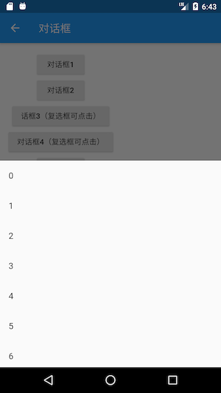

`showModalBottomSheet`The realization principle and the `showGeneralDialog`realization principle of are the same, and they are all realized by routing. Readers can check the source code comparison. But it is worth mentioning that there is another `showBottomSheet`method, which will pop up a full-screen menu list from the bottom of the device, an example is as follows:

``` dart 
// 返回的是一个controller
PersistentBottomSheetController<int> _showBottomSheet() {
 return showBottomSheet<int>(
   context: context,
   builder: (BuildContext context) {
     return ListView.builder(
       itemCount: 30,
       itemBuilder: (BuildContext context, int index) {
         return ListTile(
           title: Text("$index"),
           onTap: (){
             // do something
             print("$index");
             Navigator.of(context).pop();
           },
         );
       },
     );
   },
 );
}

```

The running effect is shown in Figure 7-17:

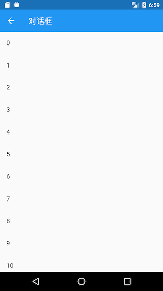

`PersistentBottomSheetController`It contains some methods to control the dialog box, such as the `close`method to close the dialog box, the function is relatively simple, readers can view the source code by themselves. The only thing to note is that it is `showBottomSheet`different from the principle of the pop-up dialog box we introduced above: it `showBottomSheet`is to call the method implementation `Scaffold`of `ScaffoldState`the `showBottomSheet`same name of the component at the top of the widget tree , that is to say, to call the `showBottomSheet`method, you must ensure that there is in the parent component `Scaffold`.

### Loading box

In fact, the Loading box can be customized directly through `showDialog`+ `AlertDialog`:

``` dart 
showLoadingDialog() {
 showDialog(
   context: context,
   barrierDismissible: false, //点击遮罩不关闭对话框
   builder: (context) {
     return AlertDialog(
       content: Column(
         mainAxisSize: MainAxisSize.min,
         children: <Widget>[
           CircularProgressIndicator(),
           Padding(
             padding: const EdgeInsets.only(top: 26.0),
             child: Text("正在加载，请稍后..."),
           )
         ],
       ),
     );
   },
 );
}

```

The display effect is shown in Figure 7-18:

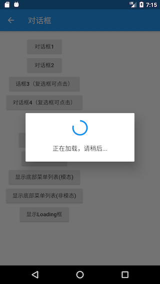

If we suspect Loading box is too wide, want to customize the width of the dialog box, then only use `SizedBox`or `ConstrainedBox`does not work, because `showDialog`the dialog box has been set up to width restrictions, in accordance with our Chapter 5, "class vessel size restrictions," a As mentioned in the above, we can `UnconstrainedBox`offset `showDialog`the restriction on the width first , and then use the `SizedBox`specified width, the code is as follows:

``` dart 
... //省略无关代码
UnconstrainedBox(
 constrainedAxis: Axis.vertical,
 child: SizedBox(
   width: 280,
   child: AlertDialog(
     content: Column(
       mainAxisSize: MainAxisSize.min,
       children: <Widget>[
         CircularProgressIndicator(value: .8,),
         Padding(
           padding: const EdgeInsets.only(top: 26.0),
           child: Text("正在加载，请稍后..."),
         )
       ],
     ),
   ),
 ),
);

```

After the code runs, the effect is shown in Figure 7-19:

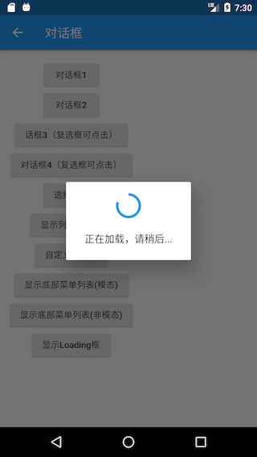

### Calendar selection

Let's take a look at the Material style calendar selector, as shown in Figure 7-20:

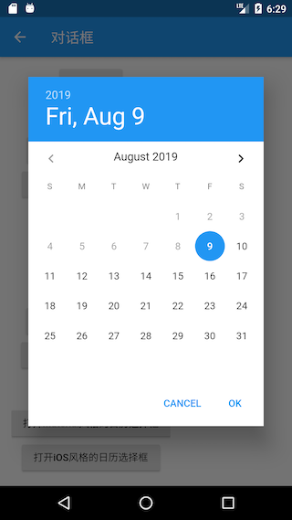

Implementation code:

``` dart 
Future<DateTime> _showDatePicker1() {
 var date = DateTime.now();
 return showDatePicker(
   context: context,
   initialDate: date,
   firstDate: date,
   lastDate: date.add( //未来30天可选
     Duration(days: 30),
   ),
 );
}

```

The iOS style calendar selector needs to use `showCupertinoModalPopup`methods and `CupertinoDatePicker`components to implement:

``` dart 
Future<DateTime> _showDatePicker2() {
 var date = DateTime.now();
 return showCupertinoModalPopup(
   context: context,
   builder: (ctx) {
     return SizedBox(
       height: 200,
       child: CupertinoDatePicker(
         mode: CupertinoDatePickerMode.dateAndTime,
         minimumDate: date,
         maximumDate: date.add(
           Duration(days: 30),
         ),
         maximumYear: date.year + 1,
         onDateTimeChanged: (DateTime value) {
           print(value);
         },
       ),
     );
   },
 );
}

```

The running effect is shown in Figure 7-21:

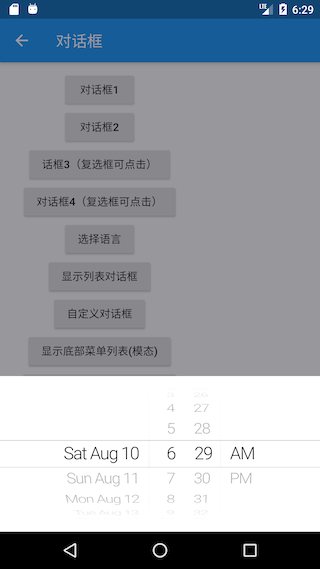