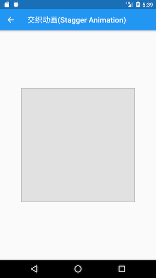
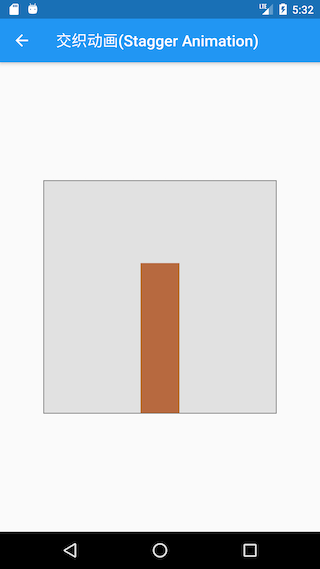

# 9.5 Interlaced animation

Sometimes we may need some complex animations. These animations may consist of an animation sequence or overlapping animations. For example, if there is a bar graph, the color needs to be changed while the height grows. After it grows to the maximum height, we need to Move a certain distance on the X axis. It can be found that the above scene contains a variety of animations at different stages. To achieve this effect, it is very simple to use Stagger Animation. The following points need to be paid attention to when interweaving animation:

1.  To create an interlaced animation, you need to use multiple animation objects ( `Animation`).
2.  One `AnimationController`control all animation objects.
3.  Specify the time interval for each animation object (Interval)

All animations are driven by the same [AnimationController](https://docs.flutter.io/flutter/animation/AnimationController-class.html) , no matter how long the animation needs to last, the value of the controller must be between 0.0 and 1.0, and the interval of each animation (Interval) must also be between 0.0 and 1.0. For each property that is animated in the interval, you need to create a [Tween](https://docs.flutter.io/flutter/animation/Tween-class.html) to specify the start value and end value of the property. In other words, 0.0 to 1.0 represents the entire animation process. We can specify different starting and ending points for different animations to determine their starting time and ending time.

### Example

Let's look at an example to implement an animation of the histogram growth:

1.  At the beginning, the height increases from 0 to 300 pixels, and the color changes from green to red; this process takes up 60% of the entire animation time.
2.  After the height increases to 300, it starts to translate 100 pixels to the right along the X axis; this process takes up 40% of the entire animation time.

We separate the Widget that performs the animation:

``` dart 
class StaggerAnimation extends StatelessWidget {
 StaggerAnimation({ Key key, this.controller }): super(key: key){
   //高度动画
   height = Tween<double>(
     begin:.0 ,
     end: 300.0,
   ).animate(
     CurvedAnimation(
       parent: controller,
       curve: Interval(
         0.0, 0.6, //间隔，前60%的动画时间
         curve: Curves.ease,
       ),
     ),
   );

   color = ColorTween(
     begin:Colors.green ,
     end:Colors.red,
   ).animate(
     CurvedAnimation(
       parent: controller,
       curve: Interval(
         0.0, 0.6,//间隔，前60%的动画时间
         curve: Curves.ease,
       ),
     ),
   );

   padding = Tween<EdgeInsets>(
     begin:EdgeInsets.only(left: .0),
     end:EdgeInsets.only(left: 100.0),
   ).animate(
     CurvedAnimation(
       parent: controller,
       curve: Interval(
         0.6, 1.0, //间隔，后40%的动画时间
         curve: Curves.ease,
       ),
     ),
   );
 }


 final Animation<double> controller;
 Animation<double> height;
 Animation<EdgeInsets> padding;
 Animation<Color> color;

 Widget _buildAnimation(BuildContext context, Widget child) {
   return Container(
     alignment: Alignment.bottomCenter,
     padding:padding.value ,
     child: Container(
       color: color.value,
       width: 50.0,
       height: height.value,
     ),
   );
 }

 @override
 Widget build(BuildContext context) {
   return AnimatedBuilder(
     builder: _buildAnimation,
     animation: controller,
   );
 }
}

```

`StaggerAnimation`Define three animation, respectively, it is `Container`a `height`, `color`, `padding`animation property set, then `Interval`specify the starting and end points throughout the animation for each animation. Let's implement the route to start the animation:

``` dart 
class StaggerRoute extends StatefulWidget {
 @override
 _StaggerRouteState createState() => _StaggerRouteState();
}

class _StaggerRouteState extends State<StaggerRoute> with TickerProviderStateMixin {
 AnimationController _controller;

 @override
 void initState() {
   super.initState();

   _controller = AnimationController(
       duration: const Duration(milliseconds: 2000),
       vsync: this
   );
 }


 Future<Null> _playAnimation() async {
   try {
     //先正向执行动画
     await _controller.forward().orCancel;
     //再反向执行动画
     await _controller.reverse().orCancel;
   } on TickerCanceled {
     // the animation got canceled, probably because we were disposed
   }
 }

 @override
 Widget build(BuildContext context) {
   return  GestureDetector(
     behavior: HitTestBehavior.opaque,
     onTap: () {
       _playAnimation();
     },
     child: Center(
       child: Container(
         width: 300.0,
         height: 300.0,
         decoration: BoxDecoration(
           color: Colors.black.withOpacity(0.1),
           border: Border.all(
             color:  Colors.black.withOpacity(0.5),
           ),
         ),
         //调用我们定义的交织动画Widget
         child: StaggerAnimation(
             controller: _controller
         ),
       ),
     ),
   );
 }
}

```

The execution effect is shown in the figure. Click on the gray rectangle in Figure 9-3 to see the entire animation effect. Figure 9-4 is a frame during the execution of the animation.

