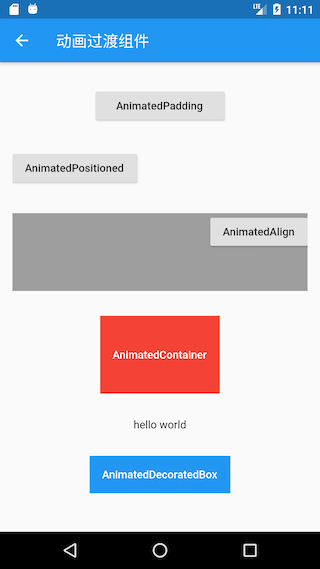

# 9.7 Animated transition components

For the convenience of presentation, this book stipulates that the components that perform transition animation when the Widget property changes are collectively referred to as "animation transition components", and the most obvious feature of an animation transition component is that it will manage itself internally `AnimationController`. We know that in order to facilitate the user to customize the animation curve, execution time, direction, etc., in the animation packaging method introduced above, the user usually needs to provide an `AnimationController`object to customize these attribute values. However, in this way, users must manually manage `AnimationController`, which will increase the complexity of use. Therefore, if it can also be `AnimationController`packaged, the ease of use of the animation component will be greatly improved.

## 9.7.1 Custom animation transition components

We want to implement one `AnimatedDecoratedBox`, which `decoration`can perform a transition animation in the process from the old state to the new state when the property changes. Based on what we have learned before, we have implemented a `AnimatedDecoratedBox1`component:

``` dart 
class AnimatedDecoratedBox1 extends StatefulWidget {
 AnimatedDecoratedBox1({
   Key key,
   @required this.decoration,
   this.child,
   this.curve = Curves.linear,
   @required this.duration,
   this.reverseDuration,
 });

 final BoxDecoration decoration;
 final Widget child;
 final Duration duration;
 final Curve curve;
 final Duration reverseDuration;

 @override
 _AnimatedDecoratedBox1State createState() => _AnimatedDecoratedBox1State();
}

class _AnimatedDecoratedBox1State extends State<AnimatedDecoratedBox1>
   with SingleTickerProviderStateMixin {
 @protected
 AnimationController get controller => _controller;
 AnimationController _controller;

 Animation<double> get animation => _animation;
 Animation<double> _animation;

 DecorationTween _tween;

 @override
 Widget build(BuildContext context) {
   return AnimatedBuilder(
     animation: _animation,
     builder: (context, child){
       return DecoratedBox(
         decoration: _tween.animate(_animation).value,
         child: child,
       );
     },
     child: widget.child,
   );
 }

 @override
 void initState() {
   super.initState();
   _controller = AnimationController(
     duration: widget.duration,
     reverseDuration: widget.reverseDuration,
     vsync: this,
   );
   _tween = DecorationTween(begin: widget.decoration);
   _updateCurve();
 }

 void _updateCurve() {
   if (widget.curve != null)
     _animation = CurvedAnimation(parent: _controller, curve: widget.curve);
   else
     _animation = _controller;
 }


 @override
 void didUpdateWidget(AnimatedDecoratedBox1 oldWidget) {
   super.didUpdateWidget(oldWidget);
   if (widget.curve != oldWidget.curve)
     _updateCurve();
   _controller.duration = widget.duration;
   _controller.reverseDuration = widget.reverseDuration;
   if(widget.decoration!= (_tween.end ?? _tween.begin)){
     _tween
       ..begin = _tween.evaluate(_animation)
       ..end = widget.decoration;
     _controller
       ..value = 0.0
       ..forward();
   }
 }

 @override
 void dispose() {
   _controller.dispose();
   super.dispose();
 }
}

```

Let's use it `AnimatedDecoratedBox1`to achieve the effect of the background color transitioning from blue to red after the button is clicked:

``` dart 
Color _decorationColor = Colors.blue;
var duration = Duration(seconds: 1);
...//省略无关代码
AnimatedDecoratedBox(
 duration: duration,
 decoration: BoxDecoration(color: _decorationColor),
 child: FlatButton(
   onPressed: () {
     setState(() {
       _decorationColor = Colors.red;
     });
   },
   child: Text(
     "AnimatedDecoratedBox",
     style: TextStyle(color: Colors.white),
   ),
 ),
)

```

The effect before clicking is shown in Figure 9-8, and a frame of the transition process is captured after clicking as shown in Figure 9-9: 

After clicking, the button background color will transition from blue to red. Figure 9-9 is a frame in the transition process, which is a bit purple. The background will turn red after the entire transition animation is over.

Although the above code achieves the desired function, the code is more complicated. After a little thought, we can find that `AnimationController`the management and Tween update part of the code can be abstracted out. If our common logic is encapsulated into a base class, then we only need to inherit these base classes to implement animation transition components, and then customize Your own different code (such as the construction method of each frame of the animation) is enough, which will simplify the code.

In order to facilitate developers to realize the encapsulation of animation transition components, Flutter provides an `ImplicitlyAnimatedWidget`abstract class, which inherits from StatefulWidget, and also provides a corresponding `ImplicitlyAnimatedWidgetState`class. `AnimationController`The management is in the `ImplicitlyAnimatedWidgetState`class. If developers want to encapsulate animation, they only need to inherit `ImplicitlyAnimatedWidget`and `ImplicitlyAnimatedWidgetState`class separately . Below we demonstrate how to implement it.

We need to implement it in two steps:

1.  Inheritance `ImplicitlyAnimatedWidget`class.
   
``` dart 
   class AnimatedDecoratedBox extends ImplicitlyAnimatedWidget {
     AnimatedDecoratedBox({
       Key key,
       @required this.decoration,
       this.child,
       Curve curve = Curves.linear, //动画曲线
       @required Duration duration, // 正向动画执行时长
       Duration reverseDuration, // 反向动画执行时长
     }) : super(
             key: key,
             curve: curve,
             duration: duration,
             reverseDuration: reverseDuration,
           );
     final BoxDecoration decoration;
     final Widget child;
   
     @override
     _AnimatedDecoratedBoxState createState() {
       return _AnimatedDecoratedBoxState();
     }
   }
   
```
   
   Wherein `curve`, `duration`, `reverseDuration`three attributes `ImplicitlyAnimatedWidget`defined in. You can see `AnimatedDecoratedBox`that `StatefulWidget`the class is no different from the normal inherited class.
   
2.  The State class inherits from `AnimatedWidgetBaseState`(the class inherits from the `ImplicitlyAnimatedWidgetState`class).
   
``` dart 
   class _AnimatedDecoratedBoxState
       extends AnimatedWidgetBaseState<AnimatedDecoratedBox> {
     DecorationTween _decoration; //定义一个Tween
   
     @override
     Widget build(BuildContext context) {
       return DecoratedBox(
         decoration: _decoration.evaluate(animation),
         child: widget.child,
       );
     }
   
     @override
     void forEachTween(visitor) {
       // 在需要更新Tween时，基类会调用此方法
       _decoration = visitor(_decoration, widget.decoration,
           (value) => DecorationTween(begin: value));
     }
   }
   
```
   
   You can see that we have implemented `build`and `forEachTween`two methods. During the execution of the animation, the `build`method is called every frame (the calling logic is `ImplicitlyAnimatedWidgetState`in), so in the `build`method we need to construct the `DecoratedBox`state of each frame , so `decoration`we have `_decoration.evaluate(animation)`to calculate the state of each frame . This can be calculated by, where `animation`is `ImplicitlyAnimatedWidgetState`The object defined in the base class is `_decoration`a `DecorationTween`type of object that we customize. The question now is when is it assigned? To answer this question, we have to figure out when we need to `_decoration`assign values. We know that it `_decoration`is a Tween, and the main responsibility of Tween is to define the beginning and ending states of the animation. For this `AnimatedDecoratedBox`, `decoration`the end state is the value passed to it by the user, and the initial state is uncertain. There are two situations:
   
   1.  `AnimatedDecoratedBox`For the first build, directly set its `decoration`value to the initial state, which `_decoration`is the value `DecorationTween(begin: decoration)`.
   2.  `AnimatedDecoratedBox`When `decoration`updating, the initial state is `_decoration.animate(animation)`, that `_decoration`is , the value `DecorationTween(begin: _decoration.animate(animation)，end:decoration)`.

Now `forEachTween`the role is obvious, it is used to update the initial value of Tween, it will be called in the above two cases, and the developer only needs to rewrite this method, and update the effect of Tween in this method The initial state value is sufficient. And some updated logic is shielded in the `visitor`callback, we only need to call it and pass it the correct parameters. The `visitor`method signature is as follows:

``` dart 
  Tween visitor(
    Tween<dynamic> tween, //当前的tween，第一次调用为null
    dynamic targetValue, // 终止状态
    TweenConstructor<dynamic> constructor，//Tween构造器，在上述三种情况下会被调用以更新tween
  );

```

As you can see, the encapsulation of animation transition components can be quickly realized through inheritance `ImplicitlyAnimatedWidget`and `ImplicitlyAnimatedWidgetState`classes. Compared with our pure manual implementation, the code is much simplified.

> If the reader still has doubts, it is recommended to check `ImplicitlyAnimatedWidgetState`the source code and compare and understand with this sample code.

### Reverse animation of animation transition component

When using the animation transition component, we only need to rebuild the component after changing some property values. Therefore, to achieve the reverse transition of the state, only need to exchange the state values ​​before and after it can be realized, which does not need to waste pen and ink. . However `ImplicitlyAnimatedWidget`, there is an `reverseDuration`attribute in the constructor to set the execution time of the reverse animation. This seems to tell the reader `ImplicitlyAnimatedWidget`that it also provides an interface for performing reverse animation. So I checked the `ImplicitlyAnimatedWidgetState`source code and found no interface for performing reverse animation. The only useful thing is that it exposes the control animation `controller`. So if you want to make it `reverseDuration`effective, we can only get `controller`it first , and then use it `controller.reverse()`to start the reverse animation. For example, based on the example above, we can implement a cyclic click background color change effect, requiring the animation execution time when changing from blue to red It is 400ms, and the change from red to blue is 2s. To make it `reverseDuration`effective, we need to do this:

``` dart 
AnimatedDecoratedBox(
 duration: Duration( milliseconds: 400),
 decoration: BoxDecoration(color: _decorationColor),
 reverseDuration: Duration(seconds: 2),
 child: Builder(builder: (context) {
   return FlatButton(
     onPressed: () {
       if (_decorationColor == Colors.red) {
         ImplicitlyAnimatedWidgetState _state =
             context.findAncestorStateOfType<ImplicitlyAnimatedWidgetState>();
          // 通过controller来启动反向动画
         _state.controller.reverse().then((e) {
           // 经验证必须调用setState来触发rebuild，否则状态同步会有问题
           setState(() {
             _decorationColor = Colors.blue;
           });
         });
       } else {
         setState(() {
           _decorationColor = Colors.red;
         });
       }
     },
     child: Text(
       "AnimatedDecoratedBox toggle",
       style: TextStyle(color: Colors.white),
     ),
   );
 }),
)

```

The above code is actually very bad and unnecessary. It requires us to understand the `ImplicitlyAnimatedWidgetState`internal implementation and manually start the reverse animation. We can achieve the same effect through the following code:

``` dart 
AnimatedDecoratedBox(
 duration: Duration(
     milliseconds: _decorationColor == Colors.red ? 400 : 2000),
 decoration: BoxDecoration(color: _decorationColor),
 child: Builder(builder: (context) {
   return FlatButton(
     onPressed: () {
       setState(() {
         _decorationColor = _decorationColor == Colors.blue
             ? Colors.red
             : Colors.blue;
       });
     },
     child: Text(
       "AnimatedDecoratedBox toggle",
       style: TextStyle(color: Colors.white),
     ),
   );
 }),
)

```

Isn't this code much more elegant! So now the question is, why `ImplicitlyAnimatedWidgetState`provide a `reverseDuration`parameter? The author carefully studied the `ImplicitlyAnimatedWidgetState`implementation and found that the only explanation is that the parameter is not for `ImplicitlyAnimatedWidgetState`use, but for subclasses! The reason is as we said before. To make it `reverseDuration`useful, you must get the `controller`property to manually start the reverse animation. `ImplicitlyAnimatedWidgetState`The `controller`property in is a protection property, defined as follows:

``` dart 
@protected
 AnimationController get controller => _controller;

```

In principle, the protection attribute should only be used in subclasses, and should not be used externally like the sample code above. In summary, we can draw two conclusions:

1.  When using animated transitions assembly if necessary to perform a reverse animation scenes, a state should be used interchangeably method, and should not be acquired by `ImplicitlyAnimatedWidgetState`the `controller`way.
   
2.  If our custom animation transition component is not used `reverseDuration`, it is best not to expose this parameter. For example, we `AnimatedDecoratedBox`can remove `reverseDuration`optional parameters from our custom definition above , such as:
   
``` dart 
   class AnimatedDecoratedBox extends ImplicitlyAnimatedWidget {
     AnimatedDecoratedBox({
       Key key,
       @required this.decoration,
       this.child,
       Curve curve = Curves.linear,
       @required Duration duration,
     }) : super(
             key: key,
             curve: curve,
             duration: duration,
           );
   
```
   

## 9.7.2 Flutter preset animation transition components

Many animation transition components are also preset in the Flutter SDK, and most of them are implemented in the same way `AnimatedDecoratedBox`, as shown in Table 9-1:

| Component Name           | Feature                                                                                                                                       |
| ------------------------ | --------------------------------------------------------------------------------------------------------------------------------------------- |
| AnimatedPadding          | When the padding changes, the transition animation will be executed to the new state                                                          |
| AnimatedPositioned       | Used together with Stack, when the positioning state changes, a transition animation will be executed to the new state.                       |
| AnimatedOpacity          | Perform a transition animation to a new state when the transparency opacity changes                                                           |
| AnimatedContainer        | When the Container property changes, a transition animation will be performed to the new state.                                               |
| AnimatedDefaultTextStyle | When the font style changes, the text components that inherit the style in the child components will dynamically transition to the new style. |


Table 9-1: Flutter preset animation transition components

Let's use an example to experience the effects of these preset animation transition components:

``` dart 
import 'package:flutter/material.dart';

class AnimatedWidgetsTest extends StatefulWidget {
 @override
 _AnimatedWidgetsTestState createState() => _AnimatedWidgetsTestState();
}

class _AnimatedWidgetsTestState extends State<AnimatedWidgetsTest> {
 double _padding = 10;
 var _align = Alignment.topRight;
 double _height = 100;
 double _left = 0;
 Color _color = Colors.red;
 TextStyle _style = TextStyle(color: Colors.black);
 Color _decorationColor = Colors.blue;

 @override
 Widget build(BuildContext context) {
   var duration = Duration(seconds: 5);
   return SingleChildScrollView(
     child: Column(
       children: <Widget>[
         RaisedButton(
           onPressed: () {
             setState(() {
               _padding = 20;
             });
           },
           child: AnimatedPadding(
             duration: duration,
             padding: EdgeInsets.all(_padding),
             child: Text("AnimatedPadding"),
           ),
         ),
         SizedBox(
           height: 50,
           child: Stack(
             children: <Widget>[
               AnimatedPositioned(
                 duration: duration,
                 left: _left,
                 child: RaisedButton(
                   onPressed: () {
                     setState(() {
                       _left = 100;
                     });
                   },
                   child: Text("AnimatedPositioned"),
                 ),
               )
             ],
           ),
         ),
         Container(
           height: 100,
           color: Colors.grey,
           child: AnimatedAlign(
             duration: duration,
             alignment: _align,
             child: RaisedButton(
               onPressed: () {
                 setState(() {
                   _align = Alignment.center;
                 });
               },
               child: Text("AnimatedAlign"),
             ),
           ),
         ),
         AnimatedContainer(
           duration: duration,
           height: _height,
           color: _color,
           child: FlatButton(
             onPressed: () {
               setState(() {
                 _height = 150;
                 _color = Colors.blue;
               });
             },
             child: Text(
               "AnimatedContainer",
               style: TextStyle(color: Colors.white),
             ),
           ),
         ),
         AnimatedDefaultTextStyle(
           child: GestureDetector(
             child: Text("hello world"),
             onTap: () {
               setState(() {
                 _style = TextStyle(
                   color: Colors.blue,
                   decorationStyle: TextDecorationStyle.solid,
                   decorationColor: Colors.blue,
                 );
               });
             },
           ),
           style: _style,
           duration: duration,
         ),
         AnimatedDecoratedBox(
           duration: duration,
           decoration: BoxDecoration(color: _decorationColor),
           child: FlatButton(
             onPressed: () {
               setState(() {
                 _decorationColor = Colors.red;
               });
             },
             child: Text(
               "AnimatedDecoratedBox",
               style: TextStyle(color: Colors.white),
             ),
           ),
         )
       ].map((e) {
         return Padding(
           padding: EdgeInsets.symmetric(vertical: 16),
           child: e,
         );
       }).toList(),
     ),
   );
 }
}

```

The effect after running is shown in Figure 9-10:



Readers can click on the corresponding component to view the actual operating effect.